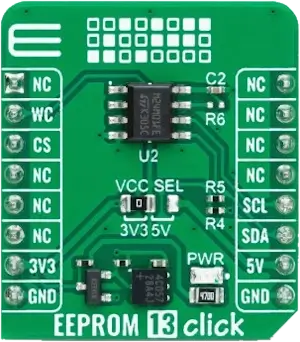

.. _mikroe_eeprom_13_click_shield:

MikroElektronika EEPROM 13 Click
================================

Overview
********

`EEPROM 13 Click`_ is a compact solution for a minimal parameter storage option
in various embedded applications.

It features the M24M01E_ (1M-bit) Serial EEPROM Memory from STMicroelectronics
with enhanced hardware write protection for entire memory, with a page size of
256 bytes and an additional 256 bytes of identification page.

   EEPROM 13 Click (Credit: MikroElektronika)

Requirements
************

This shield can only be used with a board that provides a mikroBUS™ socket and
defines a ``mikrobus_i2c`` node label for the mikroBUS™ I2C interface. See
:ref:`shields` for more details.

Programming
***********

Set ``--shield mikroe_eeprom_13_click`` when you invoke ``west build``.
For example:

.. zephyr-app-commands::
   :zephyr-app: samples/drivers/eeprom
   :board: frdm_mcxn947/mcxn947/cpu0
   :shield: mikroe_eeprom_13_click
   :goals: build

References
**********

.. target-notes::

.. _EEPROM 13 Click: https://www.mikroe.com/eeprom-13-click

.. _M24M01E: https://www.st.com/en/memories/m24m01e-f.html
