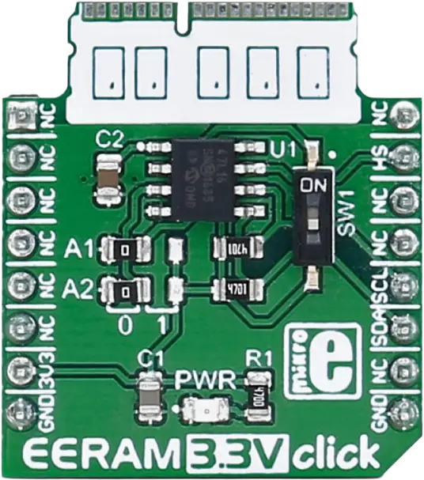

.. _mikroe_eeram_33v_click_shield:

MikroElektronika EERAM 3.3V Click
==================================

Overview
********

`EERAM 3.3V Click`_ is a compact add-on board based on the Microchip `47L16`_ 2KB I2C SRAM with
automatic EEPROM backup (EERAM).

The 47L16 exposes 2048 bytes of SRAM over I2C at address 0x50. Writes are immediate with no
page-crossing restrictions or write-cycle delays. SRAM contents are automatically backed up to
internal EEPROM on power loss, providing non-volatile storage without explicit driver involvement.

The shield overlay sets the ``eeprom-0`` alias, allowing applications to access the device through
the standard Zephyr EEPROM API via the generic ``atmel,at24`` driver.

   EERAM 3.3V Click (Credit: MikroElektronika)

Requirements
************

This shield can only be used with a board that provides a mikroBUS™ socket and defines a
``mikrobus_i2c`` node label for the mikroBUS™ I2C interface. See :ref:`shields` for more details.

Programming
***********

Set ``--shield mikroe_eeram_33v_click`` when you invoke ``west build``. For example:

.. zephyr-app-commands::
   :zephyr-app: samples/drivers/eeprom
   :board: frdm_mcxn947/mcxn947/cpu0
   :shield: mikroe_eeram_33v_click
   :goals: build

References
**********

.. target-notes::

.. _EERAM 3.3V Click: https://www.mikroe.com/eeram-33v-click

.. _47L16: https://www.microchip.com/en-us/product/47l16
