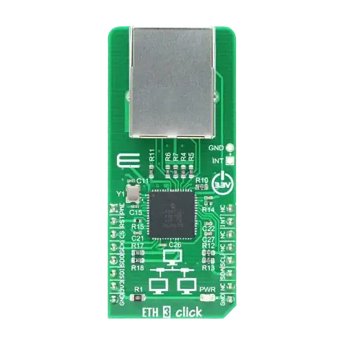

.. _mikroe_eth3_click:

MikroElektronika ETH 3 Click
############################

Overview
********

ETH 3 Click is an accessory board in mikroBus™ form factor. It features `LAN9250`_,
a 10/100Mbps BASE-T stand alone Ethernet Controller with an on-board MAC & PHY,
16Kbyte FIFO Buffer and SPI serial interface.
More information at `ETH 3 Click Shield website`_.

   MikroElektronika ETH 3 Click (Credit: MikroElektronika)

Pins Assignment of the Eth Click Shield
=======================================

+-----------------------+---------------------------------------------+
| Shield Connector Pin  | Function                                    |
+=======================+=============================================+
| RST#                  | Ethernet Controller's Reset                 |
+-----------------------+---------------------------------------------+
| CS#                   | SPI's Chip Select                           |
+-----------------------+---------------------------------------------+
| SCK                   | SPI's ClocK                                 |
+-----------------------+---------------------------------------------+
| SDO                   | SPI's Slave Data Output  (MISO)             |
+-----------------------+---------------------------------------------+
| SDI                   | SPI's Slave Data Input   (MISO)             |
+-----------------------+---------------------------------------------+
| INT                   | Ethernet Controller's Interrupt Output      |
+-----------------------+---------------------------------------------+

Requirements
************

This shield can only be used with a board which provides a configuration
for Mikro-BUS connectors and defines node aliases for SPI and GPIO interfaces
(see :ref:`shields` for more details).

Programming
***********

Set ``--shield mikroe_eth3_click`` when you invoke ``west build``. For example:

.. zephyr-app-commands::
   :zephyr-app: samples/net/dhcpv4_client
   :board: mikroe_stm32_m4_clicker
   :shield: mikroe_eth3_click
   :goals: build

References
**********

.. target-notes::

.. _ETH 3 Click Shield website:
   https://www.mikroe.com/eth-3-click

.. _LAN9250:
   https://www.microchip.com/en-us/product/lan9250
