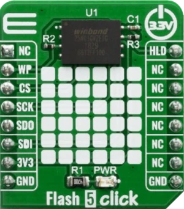

.. _mikroe_flash_5_click_shield:

MikroElektronika Flash 5 Click
================================

Overview
********

`Flash 5 Click`_ is a perfect solution for the mass storage option in various embedded applications.

It features the W25N01GVZEIG/IT (1G-bit) Serial SLC NAND Flash Memory from Winbond which provides a
storage solution for systems with limited space, pins and power. The W25N SpiFlash family
incorporates the popular SPI interface and the traditional large NAND non-volatile memory space.
They are ideal for code shadowing to RAM, executing code directly from Dual/Quad SPI (XIP) and
storing voice, text and data.

   Flash 5 Click

Requirements
************

This shield can only be used with a board that provides a mikroBUS™ socket and defines a
``mikrobus_spi`` node label for the mikroBUS™ SPI interface. See :ref:`shields` for more
details.

Programming
***********

Set ``--shield mikroe_flash_5_click`` when you invoke ``west build``. For example:

.. zephyr-app-commands::
   :zephyr-app: samples/drivers/flash_shell
   :board: frdm_mcxn947/mcxn947/cpu0
   :shield: mikroe_flash_5_click
   :goals: build

References
**********

- `Flash 5 Click`_

.. _Flash 5 Click: https://www.mikroe.com/flash-5-click
