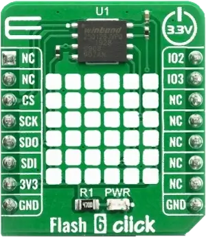

.. _mikroe_flash_6_click_shield:

MikroElektronika Flash 6 Click
==============================

Overview
********

`Flash 6 Click`_ is a perfect solution for the mass storage option in various
embedded applications.

It features the W25Q128JV_ (128M-bit) Serial NOR Flash Memory from Winbond which
provides a storage solution for systems with limited space, pins and power.
The W25Q_ SpiFlash family incorporates the popular SPI interface and the medium
sized NOR non-volatile memory space. They are ideal for code shadowing to RAM,
executing code directly from Dual/Quad SPI (XIP) and storing voice, text and
data. The small 4KB sectors allow for greater flexibility in applications that
require data and parameter storage.

   Flash 6 Click (Credit: MikroElektronika)

Requirements
************

This shield can only be used with a board that provides a mikroBUS™ socket and
defines a ``mikrobus_spi`` node label for the mikroBUS™ SPI interface. See
:ref:`shields` for more details.

Programming
***********

Set ``--shield mikroe_flash_6_click`` when you invoke ``west build``.
For example:

.. zephyr-app-commands::
   :zephyr-app: samples/drivers/flash_shell
   :board: frdm_mcxn947/mcxn947/cpu0
   :shield: mikroe_flash_6_click
   :goals: build

References
**********

.. target-notes::

.. _Flash 6 Click: https://www.mikroe.com/flash-6-click

.. _W25Q:
   https://www.winbond.com/hq/product/code-storage-flash-memory/serial-nor-flash/index.html?__locale=en

.. _W25Q128JV:
   https://www.winbond.com/hq/product/code-storage-flash-memory/serial-nor-flash/index.html?__locale=en&partNo=W25Q128JV
