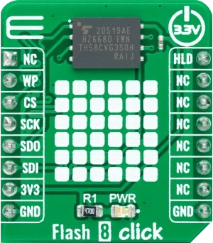

.. _mikroe_flash_8_click_shield:

MikroElektronika Flash 8 Click
================================

Overview
********

`Flash 8 Click`_ is a compact add-on board representing a highly reliable memory solution.

This board features the GD5F2GQ5UEYIGR, a 2Gb high-density non-volatile memory storage solution
for embedded systems from GigaDevice Semiconductor. It is based on an industry-standard NAND Flash
memory core, representing an attractive alternative to SPI-NOR and standard parallel NAND Flash
with advanced features. The GD5F2GQ5UEYIGR also has advanced security features (8K-Byte OTP region),
software/hardware write protection, can withstand many write cycles (minimum 100k), and has a data
retention period greater than ten years.

   Flash 8 Click

Requirements
************

This shield can only be used with a board that provides a mikroBUS™ socket and defines a
``mikrobus_spi`` node label for the mikroBUS™ SPI interface. See :ref:`shields` for more
details.

Programming
***********

Set ``--shield mikroe_flash_8_click`` when you invoke ``west build``. For example:

.. zephyr-app-commands::
   :zephyr-app: samples/drivers/flash_shell
   :board: frdm_mcxn947/mcxn947/cpu0
   :shield: mikroe_flash_8_click
   :goals: build

References
**********

- `Flash 8 Click`_

.. _Flash 8 Click: https://www.mikroe.com/flash-8-click
