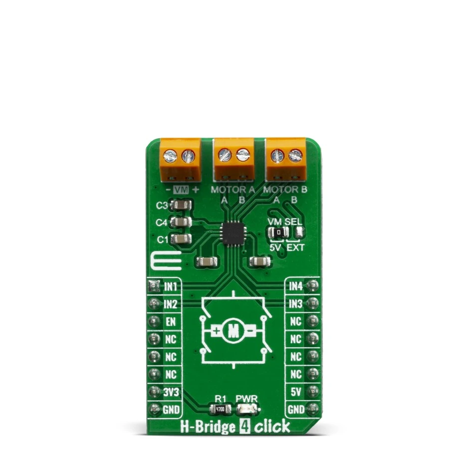

.. _mikroe_h_bridge_4_click_shield:

MikroElektronika H Bridge 4 Click
#################################

Overview
********

H-Bridge 4 Click is a Click board™ that contains the AP1010AEN, which is a two channel H-Bridge
motor driver compatible with a motor operating voltage up to 18V and can drive two DC motors or
one stepper motor. The protection circuit has under voltage lockout circuit, thermal shutdown
circuit, and overcurrent protection circuit, and overcurrent protection circuit can be disabled
with the DIS OCP terminal.

H-Bridge 4 click supports multiple connection options and can be used in different application
setups which might include DC or Stepper motors.

   MikroElektronika H Bridge 4 Click (Credit: MikroElektronika)

Requirements
************

This shield can be used with a board that  defines the ``mikrobus_header`` node label (see
:ref:`shields` for more details).

Programming
***********

.. zephyr-app-commands::
   :zephyr-app: samples/drivers/stepper/generic
   :board: <board>
   :shield: mikroe_h_bridge_4_click
   :goals: build flash

References
**********

.. target-notes::

.. _Mikroe H-Bridge 4 click:
   https://www.mikroe.com/h-bridge-4-click
