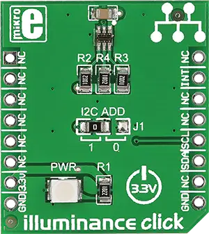

.. _mikroe_illuminance_click_shield:

MikroElektronika Illuminance Click
==================================

Overview
********

`Illuminance Click`_ is a compact add-on board that mimics how humans perceive light. This board
features ams OSRAM TSL2583, a very-high sensitivity light-to-digital converter that transforms light
intensity to a digital signal output capable of the direct I2C interface. It combines one broadband
photodiode (visible plus infrared) and one infrared-responding photodiode on a single CMOS
integrated circuit capable of providing a near-photopic response over an effective 16-bit dynamic
range (16-bit resolution). This Click board |trade| is suitable for general-purpose light sensing
applications to extend battery life and provide optimum viewing in diverse lighting conditions.

   Illuminance Click

Requirements
************

This shield can only be used with a board that provides a mikroBUS |trade| socket and defines a
``mikrobus_i2c`` node label for the mikroBUS |trade| I2C interface. See :ref:`shields` for more
details.

Programming
***********

Set ``-DSHIELD=mikroe_illuminance_click`` when you invoke ``west build``. For example:

.. zephyr-app-commands::
   :zephyr-app: samples/sensor/light_polling
   :board: mikroe_quail
   :shield: mikroe_illuminance_click
   :goals: build

See :dtcompatible:`ams,tsl2561` for documentation on the additional binding properties available for
the TSL2561 sensor, for example to adjust the gain and integration time.

References
**********

- `Illuminance Click`_

.. _Illuminance Click: https://www.mikroe.com/illuminance-click
