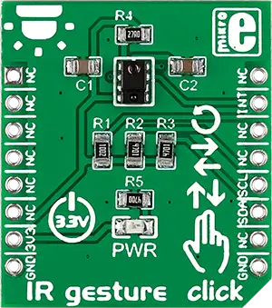

.. _mikroe_ir_gesture_click_shield:

MikroElektronika IR Gesture Click
=================================

Overview
********

`IR Gesture Click`_ is a compact add-on board that enables contactless recognition, ambient light,
and proximity sensing capabilities.

This board features the APDS-9960, a digital proximity, ambient light, RGB, and gesture sensor from
Avago Technologies. The sensor integrates an IR LED and four directional photodiodes that receive
the reflected light. An internal gesture engine deduces nearby objects' velocity, direction, and
distance (while canceling the ambient light). Various gestures can be implemented, from basic
directional swipes (up, down, left, or right) to more complex combinations. Since the chip can work
as a proximity sensor, the gesture engine can be configured to wake up automatically when a user's
hand approaches. This Click board™ makes the perfect solution for developing applications based on
gesture detection, color and ambient light sensing, mechanical
switch replacement, and more.

   IR Gesture Click

Requirements
************

This shield can only be used with a board that provides a mikroBUS |trade| socket and defines a
``mikrobus_i2c`` node label for the mikroBUS |trade| I2C interface. See :ref:`shields` for more
details.

Programming
***********

Set ``-DSHIELD=mikroe_ir_gesture_click`` when you invoke ``west build``. For example:

.. zephyr-app-commands::
   :zephyr-app: samples/sensor/apds9960
   :board: mikroe_clicker_ra4m1
   :shield: mikroe_ir_gesture_click
   :gen-args: -DCONFIG_APDS9960_TRIGGER_GLOBAL_THREAD=y
   :goals: build

References
**********

- `IR Gesture Click`_

.. _IR Gesture Click: https://www.mikroe.com/ir-gesture-click
