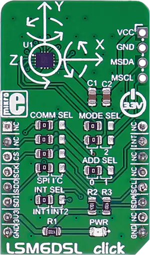

.. _mikroe_lsm6dsl_click_shield:

MikroElektronika LSM6DSL Click
==============================

Overview
********

`LSM6DSL Click`_ measures linear and angular velocity with six degrees of freedom. It carries the
LSM6DSL high-performance 3-axis digital accelerometer and 3-axis digital gyroscope. The click is
designed to run on a 3.3V power supply. `LSM6DSL Click`_ communicates with the target
micro-controller over SPI or I2C interface, with additional functionality provided by the INT pin on
the mikroBUS |trade| line.

   LSM6DSL Click

Requirements
************

This shield can only be used with a board that provides a mikroBUS |trade| socket and defines a
``mikrobus_spi`` node label for the mikroBUS |trade| SPI interface. See :ref:`shields` for more
details.

Programming
***********

Set ``-DSHIELD=mikroe_lsm6dsl_click`` when you invoke ``west build``. For example:

.. zephyr-app-commands::
   :zephyr-app: samples/sensor/accel_trig
   :board: mikroe_clicker_ra4m1
   :shield: mikroe_lsm6dsl_click
   :goals: build

References
**********

- `LSM6DSL Click`_
- `LSM6DSL Click schematic`_

.. _LSM6DSL Click: https://www.mikroe.com/lsm6dsl-click
.. _LSM6DSL Click schematic: https://download.mikroe.com/documents/add-on-boards/click/lsm6dsl/lsm6dsl-click-schematic-v100.pdf
