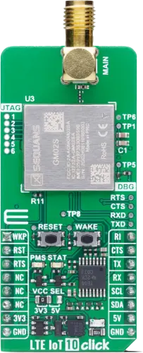

.. _mikroe_lte_iot10_click_shield:

MikroElektronika LTE IoT 10 Click
#################################

Overview
********

The MikroElektronika LTE IoT 10 Click is a compact add-on board that provides reliable LTE-M and
NB-IoT connectivity for industrial and commercial IoT applications.

This board features the Monarch 2 GM02S, a dual-mode LTE-M/NB-IoT module from Sequans (based on
Sequans SQN3430 Chipset), offering global band support from 617MHz to 2.2GHz.

   MikroElektronika LTE IoT 10 Click (Credit: MikroElektronika)

Requirements
************

This shield can only be used with a development board that provides a configuration for mikroBUS
connectors and defines a ``mikrobus_serial`` node alias for the mikroBUS UART interface
(see :ref:`shields` for more details).

For more information about the GM02S module and the LTE IoT 10 Click, you may refer to the following
documentation:

- `GM02S Datasheet`_
- `LTE IoT 10 Click`_

Programming
***********

Set ``--shield mikroe_lte_iot10_click`` when you invoke ``west build``. Here is an example with the
:zephyr:code-sample:`cellular-modem` code sample:

.. zephyr-app-commands::
   :zephyr-app: samples/net/cellular_modem
   :board: ek_ra6m4
   :shield: mikroe_lte_iot10_click
   :goals: build

References
**********

.. target-notes::

.. _GM02S Datasheet:
   https://www.sequans.com/products-solutions/gm02s/

.. _LTE IoT 10 Click:
   https://www.mikroe.com/lte-iot-10-click
