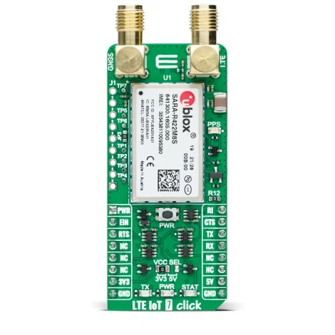

.. _mikroe_lte_iot7_click_shield:

MikroElektronika LTE IoT 7 Click
================================

Overview
********

`LTE IoT 7 Click`_ is a compact cellular connectivity Click board for LTE-M and
NB-IoT applications.

In Zephyr this shield is modeled as a modem device using the
``u-blox,sara-r4`` compatible and a mikroBUS UART connection.
Direction and modem control signals are connected to mikroBUS header lines:

- ``AN`` as ``POWER``
- ``RST`` as ``RESET``
- ``CS`` as RTS enable control through a fixed regulator node

   LTE IoT 7 Click

Requirements
************

This shield requires a board that provides mikroBUS aliases for:

- ``mikrobus_uart``
- ``mikrobus_header``

Socket selection is controlled by the board DTS aliases. See :ref:`shields`
for more details.

Programming
***********

Set ``-DSHIELD=mikroe_lte_iot7_click`` when invoking ``west build``.
For example:

.. zephyr-app-commands::
   :zephyr-app: samples/drivers/modem/at_client
   :board: mikroe_clicker_2
   :shield: mikroe_lte_iot7_click
   :goals: build

References
**********

- `LTE IoT 7 Click`_

.. _LTE IoT 7 Click: https://www.mikroe.com/lte-iot-7-click
