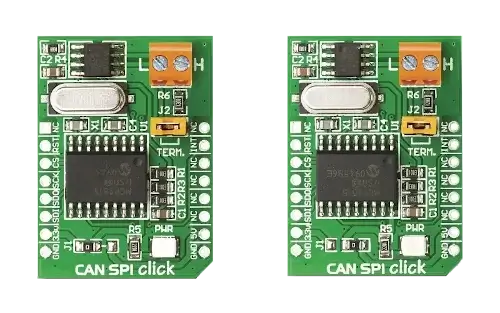
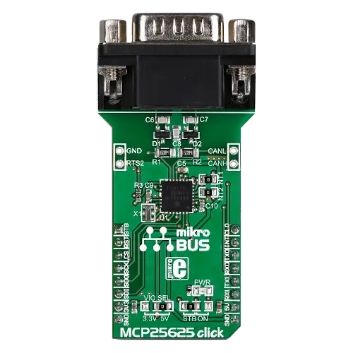

.. _mikroe_mcp251x_click_shield:

MikroElektronika MCP251x Click shields
######################################

Zephyr supports a few different MikroElektronika Click shields carrying the
Microchip `External CAN Controllers`_, either with or without integrated
`CAN Transceiver`_.

.. _mikroe_can_spi_click_shield:

MikroElektronika CAN SPI 3.3V/5V Click shield
*********************************************

Overview
--------

The CAN SPI 3.3V/5V Click shield has a `MCP2515`_ stand-alone CAN controller
via a SPI interface and a high-speed `SN65HVD230`_ CAN transceiver.

More information about the shield can be found at
`Mikroe CAN SPI 3.3V click`_ and `Mikroe CAN SPI 5V click`_.

   MikroElektronika CAN SPI 3.3V/5V Click (Credit: MikroElektronika)

.. _mikroe_mcp25625_click_shield:

MikroElektronika MCP25625 Click shield
**************************************

Overview
--------

The MCP25625 Click shield has a `MCP25625`_ CAN controller via a SPI
interface with an integrated high-speed `MCP2562`_ CAN transceiver. This
CAN controller is software compatible with the stand-alone `MCP2515`_
CAN controller.

More information about the shield can be found at
`Mikroe MCP25625 click`_.

   MikroElektronika MCP25625 Click (Credit: MikroElektronika)

Requirements
************

These shields use a mikroBUS interface. The target board must define the
``mikrobus_spi`` and ``mikrobus_header``  node labels (see :ref:`shields`
for more details). The target board must also support level triggered
interrupts and SPI clock frequency of up to 10 MHz.

Programming
***********

Set ``--shield mikroe_can_spi_click`` or ``--shield mikroe_mcp25625_click``
when you invoke ``west build``, for example:

.. zephyr-app-commands::
   :zephyr-app: samples/drivers/can/counter
   :board: lpcxpresso55s28
   :shield: mikroe_can_spi_click
   :goals: build flash

.. zephyr-app-commands::
   :zephyr-app: samples/drivers/can/counter
   :board: lpcxpresso55s28
   :shield: mikroe_mcp25625_click
   :goals: build flash

References
**********

.. target-notes::

.. _External CAN Controllers:
   https://www.microchip.com/en-us/products/interface-and-connectivity/can/can-external-controllers

.. _CAN Transceiver:
   https://www.microchip.com/en-us/products/interface-and-connectivity/can/can-transceivers

.. _SN65HVD230:
   https://www.ti.com/product/SN65HVD230

.. _MCP2515:
   https://www.microchip.com/en-us/product/MCP2515

.. _MCP2562:
   https://www.microchip.com/en-us/product/MCP2562

.. _MCP25625:
   https://www.microchip.com/en-us/product/MCP25625

.. _Mikroe CAN SPI 3.3V click:
   https://www.mikroe.com/can-spi-33v-click

.. _Mikroe CAN SPI 5V click:
   https://www.mikroe.com/can-spi-5v-click

.. _Mikroe MCP25625 click:
   https://www.mikroe.com/mcp25625-click
