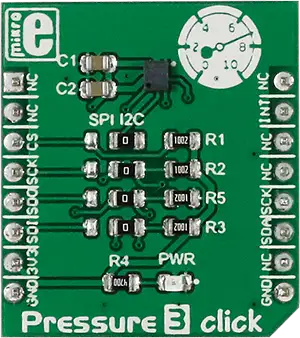

.. _mikroe_pressure_3_click_shield:

MikroElektronika Pressure 3 Click
=================================

Overview
********

`Pressure 3 Click`_ is a compact add-on board that contains a board-mount pressure sensor.

This board features the DPS310, a digital XENSIV |trade| barometric pressure sensor for portable
devices from Infineon. It is a fast sensor with a typical measurement time of 27.6ms for Standard
mode, down to 3.6ms in Low precision mode. The DPS310 has an operating range from 300 up to 1200hPa
with a relative accuracy of 0.06hPa and absolute accuracy of 1hPa. This Click board |trade| makes
the perfect solution for developing portable weather station applications, indoor navigation, drone
altitude control, and similar applications that rely on barometric pressure measurements.

   Pressure 3 Click

Requirements
************

This shield can only be used with a board that provides a mikroBUS |trade| socket and defines a
``mikrobus_i2c`` node label for the mikroBUS |trade| I2C interface. See :ref:`shields` for more
details.

Programming
***********

Set ``-DSHIELD=mikroe_pressure_3_click`` when you invoke ``west build``. For example:

.. zephyr-app-commands::
   :zephyr-app: samples/sensor/pressure_polling
   :board: mikroe_clicker_ra4m1
   :shield: mikroe_pressure_3_click
   :goals: build

References
**********

- `Pressure 3 Click`_
- `Pressure 3 Click schematic`_

.. _Pressure 3 Click: https://www.mikroe.com/pressure-3-click
.. _Pressure 3 Click schematic: https://download.mikroe.com/documents/add-on-boards/click/pressure-3/pressure-3-click-schematic-v100.pdf
