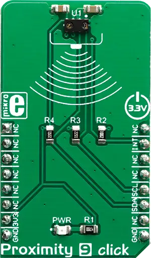

.. _mikroe_proximity_9_click_shield:

MikroElektronika Proximity 9 Click
==================================

Overview
********

`Proximity 9 Click`_ is a very accurate and reliable proximity sensing (PS) and ambient light
sensing (ALS) device, equipped with the VCNL4040, an integrated PS and ALS sensor which features the
Filtron™ technology

The 940nm IRED emitter, along with the low noise analog front end, and the PS/ALS photo-sensitive
elements, is integrated on the VCNL4040 IC, ensuring very accurate and reliable measurements. The
proprietary Filtron |trade| technology provides response near to the human eye spectral response,
providing the background light cancellation. The programmable interrupt engine allows for the
development of an optimized firmware, reducing the MCU workload and power consumption.

   Proximity 9 Click

Requirements
************

This shield can only be used with a board that provides a mikroBUS |trade| socket and defines a
``mikrobus_i2c`` node label for the mikroBUS |trade| I2C interface. See :ref:`shields` for more
details.

Programming
***********

Set ``-DSHIELD=mikroe_proximity_9_click`` when you invoke ``west build``. For example:

.. zephyr-app-commands::
   :zephyr-app: samples/sensor/proximity_polling
   :board: mikroe_clicker_ra4m1
   :shield: mikroe_proximity_9_click
   :goals: build

See :dtcompatible:`vishay,vcnl4040` for documentation on the additional binding properties available
for the VCNL4040 sensor.

References
**********

- `Proximity 9 Click`_
- `Proximity 9 Click schematic`_

.. _Proximity 9 Click: https://www.mikroe.com/proximity-9-click
.. _Proximity 9 Click schematic: https://download.mikroe.com/documents/add-on-boards/click/proximity-9/proximity-9-click-schematic-v100.pdf
