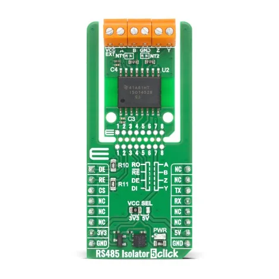

.. _mikroe_rs485_isolator_5_click_shield:

MikroElektronika RS485 Isolator 5 Click
=======================================

Overview
********

`RS485 Isolator 5 Click`_ is an isolated RS-485 transceiver Click board.
It provides galvanic isolation between the UART side and the RS-485 bus side.

   RS485 Isolator 5 Click

In Zephyr this shield is modeled as a Modbus RTU serial backend using the
``zephyr,modbus-serial`` compatible. Driver direction control is connected to
mikroBUS signals:

- ``AN`` as ``DE`` (driver enable)
- ``RST`` as ``RE`` (receiver enable, active low)

Requirements
************

This shield requires a board that provides mikroBUS aliases for:

- ``mikrobus_uart``
- ``mikrobus_header``

Socket selection is controlled by the board DTS aliases. See :ref:`shields`
for more details.

Programming
***********

Set ``-DSHIELD=mikroe_rs485_isolator_5_click`` when invoking ``west build``.
For example:

.. zephyr-app-commands::
   :zephyr-app: samples/subsys/modbus/rtu_client
   :board: mikroe_clicker_2/stm32f407xx
   :shield: mikroe_rs485_isolator_5_click
   :gen-args: -DDTC_OVERLAY_FILE=""
   :goals: build

**********

- `RS485 Isolator 5 Click`_
- `RS485 Isolator 5 Click schematic`_

.. _RS485 Isolator 5 Click: https://www.mikroe.com/rs485-isolator-5-click
.. _RS485 Isolator 5 Click schematic: https://download.mikroe.com/documents/add-on-boards/click/rs485-isolator-5/rs485-isolator-5-click-schematic-v100.pdf
