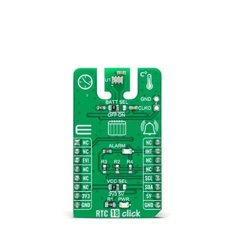

.. _mikroe_rtc_18_click_shield:

MikroElektronika RTC 18 Click
#############################

Overview
********

RTC 18 Click shield is built around the Micro Crystal **RV-3032-C7** temperature-compensated
real-time clock (RTC) module.
The module offers I²C communication, integrated timekeeping with leap year support, alarm and
interrupt features, and a battery backup switchover circuit.

The RTC is designed for high accuracy (≈ ±0.22 s/day) and extremely low power consumption, allowing
it to retain time using a small backup battery when main supply is removed.

More information about the shield can be found at
`Mikroe RTC 18 click`_.

   MikroElektronika RTC 18 Click (Credit: MikroElektronika d.o.o.)

Requirements
************

The shield uses a mikroBUS interface. The target board must define
a ``mikrobus_i2c`` and ``mikrobus_header`` node labels
(see :ref:`shields` for more details).

Programming
***********

.. zephyr-app-commands::
   :zephyr-app: samples/drivers/rtc/
   :board: <board>
   :shield: mikroe_rtc_18_click
   :goals: build flash

References
**********

.. target-notes::

.. _Mikroe RTC 18 click:
   https://www.mikroe.com/rtc-18-click
