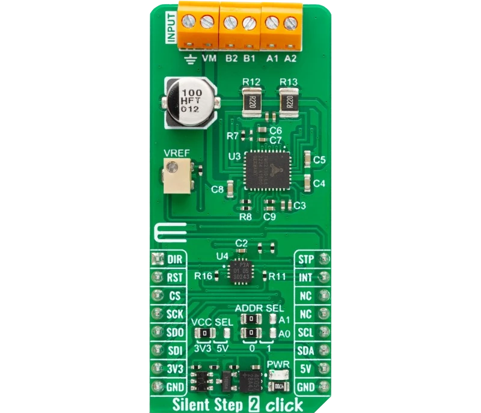

.. _mikroe_silent_step_2_click:

MikroElektronika Silent Step 2 Click
####################################

Overview
********

The MikroElektronika `Silent Step 2 Click`_ features the `ADI TMC2130`_ stepper driver with step-dir
control via gpio and configuration via spi. A `NXP PCA9538A`_ gpio expander accessed via i2c offers
access to additional pins of th stepper driver.

   MikroElektronika Silent Step 2 Click (Credit: MikroElektronika)

Requirements
************

This shield can only be used with a board that provides a mikroBUS
socket and defines a ``mikrobus_i2c`` node label for the mikroBUS I2C
interface, a ``mikrobus_spi`` node label for the mikroBUS SPI
interface and a ``mikrobus_header`` node label (see :ref:`shields` for more details).

Programming
***********

.. zephyr-app-commands::
   :zephyr-app: samples/drivers/stepper/generic/
   :board: <board>
   :shield: mikroe_silent_step_2_click
   :goals: build

.. _Silent Step 2 Click:
   https://www.mikroe.com/silent-step-2-click

.. _ADI TMC2130:
   https://www.analog.com/en/products/tmc2130.html

.. _NXP PCA9538A:
   https://www.nxp.com/products/interfaces/ic-spi-i3c-interface-devices/general-purpose-i-o-gpio/low-voltage-8-bit-ic-bus-i-o-port-with-interrupt-and-reset:PCA9538A
