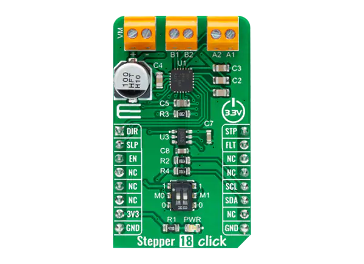

.. _mikroe_stepper_18_click_shield:

MikroElektronika Stepper 18 Click
#################################

Overview
********

Stepper 18 Click shield has a TI DRV426 stepper driver accessed via GPIO.
It also features a Microchip MCP4726 DAC to allow for current control. The
micro-step pins are controlled via physical switches, making them unavailable
in Zephyr.
The DRV8426 uses the work-queue timing source by default.

Note that the MCP4726 is compatible with the MCP4725 driver.

More information about the shield can be found at
`Mikroe Stepper 18 click`_.

   MikroElektronika Stepper 18 Click (Credit: MikroElektronika)

Requirements
************

The shield uses a mikroBUS interface. The target board must define
a ``mikrobus_i2c`` and ``mikrobus_header``  node labels
(see :ref:`shields` for more details).

Programming
***********

.. zephyr-app-commands::
   :zephyr-app: samples/drivers/stepper/generic/
   :board: <board>
   :shield: mikroe_stepper_18_click
   :goals: build flash

References
**********

.. target-notes::

.. _Mikroe Stepper 18 click:
   https://www.mikroe.com/stepper-18-click
