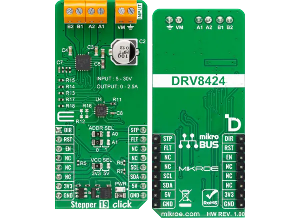

.. _mikroe_stepper_19_click_shield:

MikroElektronika Stepper 19 Click
#################################

Overview
********

Stepper 19 Click shield has a TI DRV8424 stepper driver accessed via GPIO and
a TI TCA9538 GPIO expander accessed via I2C. Some DRV8424 pins are accessed
via the GPIO expander.
The DRV8424 uses by default the work-queue timing source, but that can be changed.

More information about the shield can be found at
`Mikroe Stepper 19 click`_.

   MikroElektronika Stepper 19 Click (Credit: MikroElektronika)

Requirements
************

The shield uses a mikroBUS interface. The target board must define
a ``mikrobus_i2c`` and ``mikrobus_header``  node labels
(see :ref:`shields` for more details).

Programming
***********

.. zephyr-app-commands::
   :zephyr-app: samples/drivers/stepper/generic/
   :board: <board>
   :shield: mikroe_stepper_19_click
   :goals: build flash

References
**********

.. target-notes::

.. _Mikroe Stepper 19 click:
   https://www.mikroe.com/stepper-19-click
