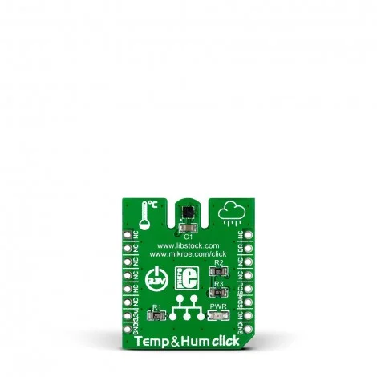

.. _mikroe_temp_hum_click_shield:

MikroElektronika Temp&Hum Click
===============================

Overview
********

`Temp&Hum Click`_ is a Click board for temperature and relative humidity
measurement based on the HTS221 digital sensor.

This shield exposes the HTS221 over I2C on a mikroBUS socket.

   Temp&Hum Click

Requirements
************

This shield requires a board with a mikroBUS socket and an I2C node label
compatible with the selected socket wiring (for example ``mikrobus_i2c`` or
board-specific ``mikrobus_1_i2c`` / ``mikrobus_2_i2c``). See :ref:`shields`
for more details.

Programming
***********

Set ``-DSHIELD=mikroe_temp_hum_click`` when invoking ``west build``. For example:

.. zephyr-app-commands::
   :zephyr-app: samples/sensor/hts221
   :board: mikroe_clicker_2
   :shield: mikroe_temp_hum_click
   :goals: build

See :dtcompatible:`st,hts221` for documentation on additional binding
properties.

References
**********

- `Temp&Hum Click`_
- `HTS221`_

.. _Temp&Hum Click: https://www.mikroe.com/temp-hum-click
.. _HTS221: https://www.st.com/en/mems-and-sensors/hts221.html
