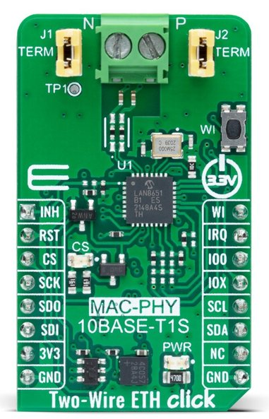

.. _mikroe_two_wire_eth_click_shield:

MikroElektronika Two Wire ETH Click
===================================

Overview
********

The Two-Wire ETH Click Shield is a compact add-on board featuring the `LAN8651B1-E/LM`_,
a low-power 10BASE-T1S MAC-PHY Ethernet Controller with SPI from Microchip.
It combines a MAC and Ethernet PHY to provide low-cost MCUs access to 10BASE-T1S
networks with support for multidrop and point-to-point topologies. Host communication
uses high-speed SPI per the OPEN Alliance 10BASE-T1x MAC-PHY Serial Interface
specification. More information at `Two-Wire ETH Click Shield website`_.

   MikroElektronika Two Wire ETH Click (Credit: MikroElektronika)

Pins Assignment of the Eth Click Shield
=======================================

+-----------------------+---------------------------------------------+
| Shield Connector Pin  | Function                                    |
+=======================+=============================================+
| RST#                  | Ethernet Controller's Reset                 |
+-----------------------+---------------------------------------------+
| CS#                   | SPI's Chip Select                           |
+-----------------------+---------------------------------------------+
| SCK                   | SPI's Clock                                 |
+-----------------------+---------------------------------------------+
| SDO                   | SPI's Slave Data Output  (MISO)             |
+-----------------------+---------------------------------------------+
| SDI                   | SPI's Slave Data Input   (MOSI)             |
+-----------------------+---------------------------------------------+
| INT                   | Ethernet Controller's Interrupt Output      |
+-----------------------+---------------------------------------------+

Requirements
************

This shield can only be used with a board which provides a configuration
for Mikro-BUS connectors and defines node aliases for SPI and GPIO interfaces
(see :ref:`shields` for more details).

Programming
***********

Set ``--shield mikroe_two_wire_eth_click`` when you invoke ``west build``. For example:

.. zephyr-app-commands::
   :zephyr-app: samples/net/dhcpv4_client
   :board: frdm_mcxn947/mcxn947/cpu0
   :shield: mikroe_two_wire_eth_click
   :goals: build

References
**********

.. target-notes::

.. _Two-Wire ETH Click Shield website:
   https://www.mikroe.com/two-wire-eth-click

.. _LAN8651B1-E/LM:
   https://www.microchip.com/en-us/product/lan8651
