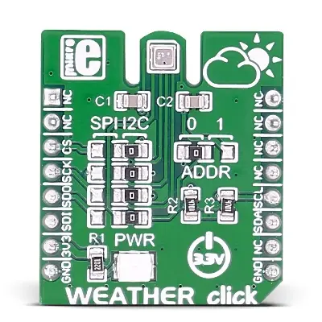

.. _mikroe_weather_click:

MikroElektronika Weather Click
##############################

Overview
********

The MikroElektronika `Weather Click`_ features the `BME280`_ integrated
environmental sensor in a `mikroBUS`_ |trade| form factor. The sensor can
measure relative humidity, barometric pressure, and ambient temperature.

   MikroElektronika Weather Click (Credit: MikroElektronika)

Requirements
************

This shield can only be used with a board that provides a mikroBUS |trade|
socket and defines a ``mikrobus_i2c`` node label for the mikroBUS |trade| I2C
interface or a ``mikrobus_spi`` node label for the mikroBUS |trade| SPI
interface (see :ref:`shields` for more details).

.. note::

   By default the Weather Click is configured to use the I2C interface. In
   order to use the SPI interface the jumper settings must be changed. See
   the `Weather Click Schematic`_ for further details.

For more information about the BME280 and the Weather Click, see the following
documentation:

- `Weather Click`_
- `Weather Click Schematic`_
- `BME280`_
- `BME280 Datasheet`_

Programming
***********

Set ``--shield mikroe_weather_click_i2c`` or
``--shield mikroe_weather_click_spi`` when you invoke ``west build``. For
example:

.. zephyr-app-commands::
   :zephyr-app: samples/sensor/bme280
   :board: lpcxpresso55s16
   :shield: [mikroe_weather_click_i2c | mikroe_weather_click_spi]
   :goals: build

.. _Weather Click:
   https://www.mikroe.com/weather-click

.. _Weather Click Schematic:
   https://download.mikroe.com/documents/add-on-boards/click/weather/weather-click-schematic-v101.pdf

.. _BME280:
   https://www.bosch-sensortec.com/products/environmental-sensors/humidity-sensors-bme280/

.. _BME280 Datasheet:
   https://www.bosch-sensortec.com/media/boschsensortec/downloads/datasheets/bst-bme280-ds002.pdf

.. _mikroBUS:
   https://www.mikroe.com/mikrobus
