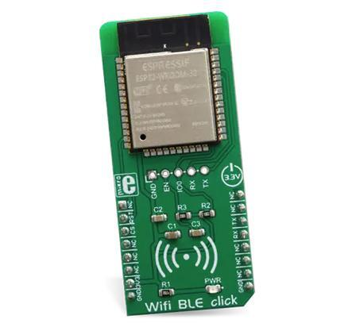

.. _mikroe_wifi_bt_click:

MikroElektronika WIFI and BLE Shield
####################################

Overview
********

This shield contains an Espressif Systems ESP32 which is responsible
to offload the WIFI and Bluetooth tasks from the host processor. It uses
the standard MikroBus interface with UART pins plus its Espressif AT
command set. Alternatively, the Zephyr modem driver can be used,
configuring the module as a native WIFI networking interface.

Pins Assignment of the Shield
=============================

+-----------------------+---------------------------------------------+
| Shield Connector Pin  | Function                                    |
+=======================+=============================================+
| RST#                  | Reset pin, in most of the boards it should  |
|                       | be disconnected because its tied to GND     |
+-----------------------+---------------------------------------------+
| TX                    | UART TX communication pin                   |
+-----------------------+---------------------------------------------+
| RX                    | UART RX communication pin                   |
+-----------------------+---------------------------------------------+

Requirements
************

This shield requires a board which provides a configuration that allows an
UART interface. (see :ref:`shields` for more details).

.. note::
   Sometimes boards declare standard headers like Arduino R3 but don't
   define all connections.  Make sure that the board you are using includes
   all required definitions to avoid build errors.

This shield should be loaded with the `ESP32 AT Bin`_ software which is
available at Espressif Systems web site. This version is command
compatible with ESP32 AT Bin 2.0.0, after getting the binary from Espressif
site, connect the J1 of the board to a serial-to-USB converter of your
preference, or to one Espressif programming boards like ESP-Prog. Install
the `ESP-Tool`_, extract the folder, navigate inside the binaries location
and type the following command to flash the device:

.. code-block:: console

   esptool.py --chip auto \
   --before default_reset \
   --after hard_reset write_flash \
   --flash_mode dio \
   --flash_freq 40m \
   --flash_size detect \
   0x10000 ota_data_initial.bin \
   0x1000 bootloader/bootloader.bin \
   0x20000 at_customize.bin \
   0x21000 customized_partitions/ble_data.bin \
   0x24000 customized_partitions/server_cert.bin \
   0x26000 customized_partitions/server_key.bin \
   0x28000 customized_partitions/server_ca.bin \
   0x2a000 customized_partitions/client_cert.bin \
   0x2c000 customized_partitions/client_key.bin \
   0x2e000 customized_partitions/client_ca.bin \
   0x30000 customized_partitions/factory_param.bin \
   0xf000 phy_init_data.bin \
   0x100000 esp-at.bin \
   0x8000 partitions_at.bin

If necessary, you can indicate a specific port and the baud rate via
``--port <Selected PORT>`` and ``--baud 115200``.

Once flashed, it is possible to verify the module. While connected, open your preferred
terminal configured as 115200, 8, N, 1 and perform a board reset. You should see an
initial log and last message should be the version of the AT firmware flashed.

.. note::
   Boards that already have a network interface:  Check the network
   documentation to understand how to properly configure both interfaces.
   To keep things simple, make sure WiFi is the only interface enabled in
   Networking -> Link Layer Options.  This will avoid problems running
   Zephyr samples.

Build and Programming
*********************

Set ``--shield <shield designation>`` when you invoke ``west build``.

See the example below for lpcxpresso55s69 board using Mikrobus serial:

.. zephyr-app-commands::
   :zephyr-app: samples/net/wifi
   :board: lpcxpresso55s69/lpc55s69/cpu0
   :shield: mikroe_wifi_bt_click_mikrobus
   :goals: build flash

And this example for the b_u585i_iot02a development kit, using the Arduino connector for the UART pins:

.. zephyr-app-commands::
   :zephyr-app: samples/net/wifi
   :board: b_u585i_iot02a
   :shield: mikroe_wifi_bt_click_arduino
   :goals: build flash

References
**********

.. target-notes::

.. _ESP32 AT Bin:
   https://docs.espressif.com/projects/esp-at/en/latest/esp32/AT_Binary_Lists/ESP32_AT_binaries.html

.. _WIFI BT Click Shield website:
   https://www.mikroe.com/

.. _ESP-Tool:
   https://github.com/espressif/esptool
