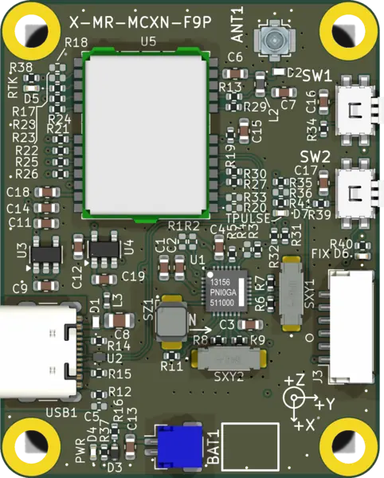

.. _mr_mcxn_t1_f9p_shield:

MR-MCXN-T1-F9P GNSS Shield
##########################

   MR-MCXN-T1-F9P GNSS Shield

Overview
********

The MR-MCXN-T1-F9P GNSS expansion board is a stacking shield for the
:zephyr:board:`mr_mcxn_t1`. It carries:

- u-blox ZED-F9P multi-band RTK GNSS receiver
- PNI RM3100 3-axis magnetometer

The F9P primary UART is routed to FlexCOMM7 and a second UART, used for RTCM
correction traffic, is routed to FlexCOMM3. The RM3100 is on the FlexCOMM4
I2C bus. The receiver reset and the magnetometer data-ready line are wired to
the board's stacking-header GPIO nexus.

Requirements
************

This shield mates the MR-MCXN-T1 stacking header and works only with the
:zephyr:board:`mr_mcxn_t1` board. It cannot be combined with the
MR-MCXN-T1-OFL optical-flow shield (both claim FlexCOMM7) in the same stack.
It also cannot share a stack with the MR-MCXN-T1-IO Flex IO shield, whose
FlexPWM channels use the same port-3 header pins.

The receiver output rate, time-pulse capture, and any network time
distribution are application concerns and are intentionally left out of the
shield definition.

Pin Assignments
***************

+-----------------------+-----------------------------------------------+
| Function              | MR-MCXN-T1 resource                           |
+=======================+===============================================+
| F9P primary UART      | FlexCOMM7 (LPUART)                            |
+-----------------------+-----------------------------------------------+
| F9P corrections UART  | FlexCOMM3 (LPUART)                            |
+-----------------------+-----------------------------------------------+
| RM3100 I2C            | FlexCOMM4 (LPI2C)                             |
+-----------------------+-----------------------------------------------+

Programming
***********

Set ``--shield mr_mcxn_t1_f9p`` when building. For example, to run the
GNSS sample:

.. zephyr-app-commands::
   :zephyr-app: samples/drivers/gnss
   :board: mr_mcxn_t1/mcxn947/cpu0
   :shield: mr_mcxn_t1_f9p
   :goals: build flash
   :compact:

References
**********

- `ZED-F9P product page <https://www.u-blox.com/en/product/zed-f9p-module>`_
- `RM3100 product page <https://www.pnicorp.com/rm3100/>`_
- `MR-MCXN-T1 shield hardware design files (KiCad) <https://github.com/CogniPilot/spinali_mcxn_t1_shields>`_
