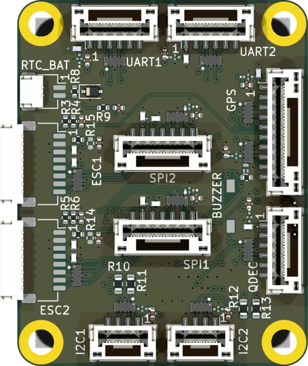

.. _mr_mcxn_t1_io_shield:

MR-MCXN-T1-IO Flex IO Shield
############################

   MR-MCXN-T1-IO Flex IO Shield

Overview
********

The MR-MCXN-T1-IO Flex IO expansion board is a passive breakout stacking shield for
the :zephyr:board:`mr_mcxn_t1`. It carries no fixed silicon; instead it routes
a set of the board's peripheral buses to expansion connectors:

- One expansion I2C bus (FlexCOMM3)
- Two UARTs with hardware flow control (FlexCOMM0 and FlexCOMM2)
- Two FlexPWM blocks, four channels each (FlexPWM0 and FlexPWM1)
- One ADC (LPADC1)

The shield overlay enables these buses. Because the board is passive, the
devices attached to the expansion connectors, the ADC channel configuration
and any PWM consumers are defined by the application overlay.

Requirements
************

This shield mates the MR-MCXN-T1 stacking header and works only with
the :zephyr:board:`mr_mcxn_t1` board. Its FlexPWM channels and the expansion
I2C share port-3 and FlexCOMM3 pins with the MR-MCXN-T1-F9P GNSS and
MR-MCXN-T1-OFL optical-flow shields, so it cannot be stacked together with
either of them.

Pin Assignments
***************

+-----------------------+-----------------------------------------------+
| Function              | MR-MCXN-T1 resource                           |
+=======================+===============================================+
| Expansion I2C         | FlexCOMM3 (LPI2C)                             |
+-----------------------+-----------------------------------------------+
| UART 0 (flow control) | FlexCOMM0 (LPUART)                            |
+-----------------------+-----------------------------------------------+
| UART 2 (flow control) | FlexCOMM2 (LPUART)                            |
+-----------------------+-----------------------------------------------+
| PWM 0                 | FlexPWM0 (4 channels)                         |
+-----------------------+-----------------------------------------------+
| PWM 1                 | FlexPWM1 (4 channels)                         |
+-----------------------+-----------------------------------------------+
| ADC                   | LPADC1                                        |
+-----------------------+-----------------------------------------------+

Programming
***********

Set ``--shield mr_mcxn_t1_io`` when building. The application overlay
adds the devices on the expansion connectors. For example:

.. zephyr-app-commands::
   :zephyr-app: samples/hello_world
   :board: mr_mcxn_t1/mcxn947/cpu0
   :shield: mr_mcxn_t1_io
   :goals: build flash
   :compact:

References
**********

- `MR-MCXN-T1 shield hardware design files (KiCad) <https://github.com/CogniPilot/spinali_mcxn_t1_shields>`_
