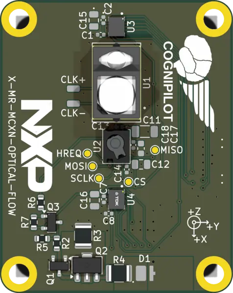

.. _mr_mcxn_t1_ofl_shield:

MR-MCXN-T1-OFL Optical Flow Shield
##################################

   MR-MCXN-T1-OFL Optical Flow Shield

Overview
********

The MR-MCXN-T1-OFL optical-flow expansion board is a stacking shield for the
:zephyr:board:`mr_mcxn_t1`. It carries a downward-facing sensor cluster used
for visual odometry and altitude hold:

- Broadcom AFBR-S50 time-of-flight rangefinder
- PixArt PAA3905 optical-flow sensor
- TDK InvenSense ICM-42688 6-axis IMU
- TDK InvenSense ICM-45686 6-axis IMU

Each device is on its own SPI bus routed through the MR-MCXN-T1 stacking
header. Sensor interrupt lines are wired to the header's GPIO control-line
nexus. The AFBR-S50 additionally drives its SPI signals in GPIO mode during
start-up to read the sensor's internal EEPROM.

Requirements
************

This shield mates the MR-MCXN-T1 stacking header and works only with the
:zephyr:board:`mr_mcxn_t1` board. It cannot be combined with the
MR-MCXN-T1-F9P GNSS shield (both claim FlexCOMM7) in the same stack. It also
cannot share a stack with the MR-MCXN-T1-IO Flex IO shield (both claim
FlexCOMM3).

Pin Assignments
***************

+-----------------------+-----------------------------------------------+
| Function              | MR-MCXN-T1 resource                           |
+=======================+===============================================+
| AFBR-S50 SPI          | FlexCOMM3 (LPSPI)                             |
+-----------------------+-----------------------------------------------+
| ICM-42688 SPI         | FlexCOMM6 (LPSPI)                             |
+-----------------------+-----------------------------------------------+
| ICM-45686 SPI         | FlexCOMM7 (LPSPI)                             |
+-----------------------+-----------------------------------------------+
| PAA3905 SPI           | FlexCOMM9 (LPSPI)                             |
+-----------------------+-----------------------------------------------+

Programming
***********

Set ``--shield mr_mcxn_t1_ofl`` when building. For example, to run the
sensor shell against the flow cluster:

.. zephyr-app-commands::
   :zephyr-app: samples/sensor/sensor_shell
   :board: mr_mcxn_t1/mcxn947/cpu0
   :shield: mr_mcxn_t1_ofl
   :goals: build flash
   :compact:

References
**********

- `AFBR-S50 product page <https://www.broadcom.com/products/optical-sensors/time-of-flight-3d-sensors/afbr-s50mv85g>`_
- `PAA3905 product page <https://www.pixart.com/products-detail/44/PAA3905E1-Q>`_
- `MR-MCXN-T1 shield hardware design files (KiCad) <https://github.com/CogniPilot/spinali_mcxn_t1_shields>`_
