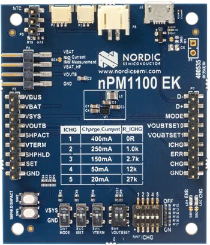

.. _npm1100_ek:

nPM1100 EK
##########

Overview
********

The nPM1100 EK lets you test different functions and features of the nPM1100
Power Management Integrated Circuit (PMIC).

   nPM1100 EK

Requirements
************

The nPM1100 EK board is not designed to fit straight into an Arduino connector.
However, the Zephyr shield is designed expecting it to be connected to the
Arduino shield pins. This allows to use the shield with any host board that
supports the Arduino connector. The connections are:

+-----------+--------------+
| PMIC Pin  | Arduino Pin  |
+===========+==============+
| ISET      | D2           |
| MODE      | D3           |
+-----------+--------------+

Usage
*****

The shield can be used in any application by setting ``--shield npm1100_ek``
when invoking ``west build``.

References
**********

- `nPM1100 EK Manual <https://infocenter.nordicsemi.com/topic/ug_npm1100_ek/UG/nPM1100_EK/intro.html>`_
