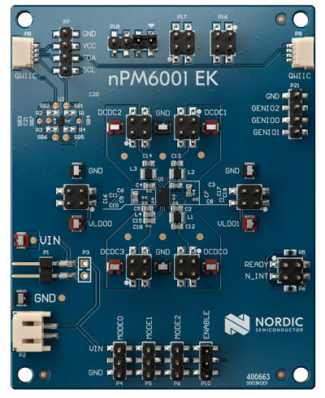

.. _npm6001_ek:

nPM6001 EK
##########

Overview
********

The nPM6001 EK lets you test different functions and features of the nPM6001
Power Management Integrated Circuit (PMIC).

   nPM6001 EK

Requirements
************

The nPM6001 EK board is not designed to fit straight into an Arduino connector.
However, the Zephyr shield is designed expecting it to be connected to the
Arduino shield connectors. For example, the I2C lines need to be connected to
the ``arduino_i2c`` bus. This allows to use the shield with any host board that
supports the Arduino connector.

Usage
*****

The shield can be used in any application by setting ``SHIELD`` to
``npm6001_ek``. You can check :ref:`npm6001_ek_sample` for a comprehensive
sample.

References
**********

- `nPM6001 EK Manual <https://infocenter.nordicsemi.com/topic/ug_npm6001_ek/UG/nPM6001_EK/intro.html>`_
