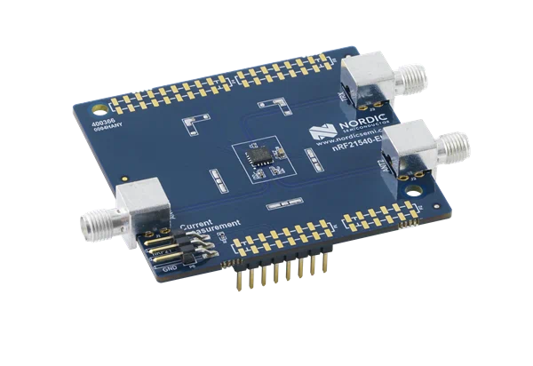

.. _nrf21540_ek:

nRF21540 EK
###########

The nRF21540 EK (Evaluation Kit) is an RF front-end module (FEM) for
Bluetooth Low Energy, Bluetooth mesh, 2.4 GHz proprietary, Thread, and
Zigbee range extension.
When combined with an nRF52 or nRF53 Series SoC, the nRF21540 RF FEM’s
+21 dBm TX output power and 13 dB RX gain ensure a superior link budget for
up to 16x range extension.

The nRF21540 complementary device has a 50Ω SMA input and 2x 50Ω SMA outputs.
This enables connecting an SoC or a signal generator to the input.
It also enables connecting the outputs to measurement tools or to antennas
directly.
The FEM can be configured through the pins available on the Arduino headers.

The nRF21540's gain control, antenna switching, and modes are controlled via
GPIO or SPI or a combination of both, accessible through
the Arduino Uno Rev3 compatible headers.
The shield also features two additional SMA connectors hooked to the
dual antenna ports from the RF FEM, to monitor the performance of the RF FEM
using any equipment desired.
The FEM SMA input can be connected to the nRF52 or nRF53 Series SoC RF output
with a coaxial RF cable with SMA\SWF connectors.

Overview
********

Pin assignment of the nRF21540 EK
=================================

+-----------------------+----------+-----------------+
| Shield Connector Pin  | SIGNAL   | FEM Function    |
+=======================+==========+=================+
| D2                    | GPIO     | Mode Select     |
+-----------------------+----------+-----------------+
| D3                    | GPIO     | RX Enable       |
+-----------------------+----------+-----------------+
| D4                    | GPIO     | Antenna Select  |
+-----------------------+----------+-----------------+
| D5                    | GPIO     | TX Enable       |
+-----------------------+----------+-----------------+
| D9                    | GPIO     | Power Down      |
+-----------------------+----------+-----------------+
| D10                   | SPI CS   | Chip Select     |
+-----------------------+----------+-----------------+
| D11                   | SPI MOSI | Serial Data In  |
+-----------------------+----------+-----------------+
| D12                   | SPI MISO | Serial Data Out |
+-----------------------+----------+-----------------+
| D13                   | SPI SCK  | Serial Clock    |
+-----------------------+----------+-----------------+

Programming
***********

Set ``-DSHIELD=nrf21540_ek`` when you invoke ``west build`` or ``cmake`` in your
Zephyr application.

Alternatively, add the shield in the project's :file:`CMakeLists.txt` file:

.. code-block:: none

	set(SHIELD nrf21540_ek)

References
**********

.. target-notes::

.. _nRF21540 website:
   https://www.nordicsemi.com/Products/Low-power-short-range-wireless/nRF21540

.. _nRF21540 Product Specification and other documentation:
   https://infocenter.nordicsemi.com/topic/struct_fem/struct/nrf21540.html
