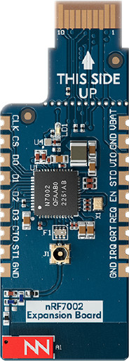

.. _nrf7002eb:

nRF7002 EB
##########

Overview
********

The nRF7002 EB is a versatile evaluation kit in the form of a thumbstick shield which connects to
compatible Nordic host boards, like the Thingy53, using the Nordic edge-connector.

The nRF7002 EB unlocks low-power Wi-Fi 6 capabilities for your host device. It support dual-band Wi-Fi
2.4GHz and 5GHz, and is based on the nRF7002 SoC.
Seamlessly connect to Wi-Fi networks and leverage Wi-Fi-based locationing, enabling advanced
features such as SSID sniffing of local Wi-Fi hubs

   nRF7002 EB

Requirements
************

The nRF7002 EB board is designed to fit straight into a Nordic edge-connector and uses SPI as the
communication interface. Any host board that supports the Nordic edge-connector can be used with
the nRF7002 EB.

Prerequisites
-------------

the nRF70 driver requires firmware binary blobs for Wi-Fi operation. Run the command
below to retrieve those files.

.. code-block:: console

   west update
   west blobs fetch hal_nordic

Usage
*****

The shield can be used in any application by setting ``--shield nrf7002eb`` when invoking ``west build``.

Shield Variants
###############

The nRF7002 EB has a variant which includes the COEX pins. These pins are not be routed to the
edge-connector on some boards, like earlier revisions of the Thingy53 than v1.0.0.

- ``nrf7002eb``: The default variant.
- ``nrf7002eb_coex``: Variant which includes the COEX pins.

SR Co-existence
###############

The nRF7002 EB supports SR co-existence provided the host board supports it. The SR co-existence
pins are connected to the host board's GPIO pins.

Two Kconfig options are available to enable SR co-existence:

- :kconfig:option:`CONFIG_NRF70_SR_COEX`: Enables SR co-existence.
- :kconfig:option:`CONFIG_NRF70_SR_COEX_RF_SWITCH`: Control SR side RF switch.

References
**********

- `Developing with nRF7002 EB <https://docs.nordicsemi.com/bundle/ncs-latest/page/nrf/app_dev/device_guides/nrf70/nrf7002eb_dev_guide.html>`_
- `nRF7002 EB product specification <https://infocenter.nordicsemi.com/topic/ug_nrf7002_eb/UG/nrf7002_EB/intro.html>`_
- `nRF7002 product specification <https://infocenter.nordicsemi.com/index.jsp?topic=%2Fstruct_nrf70%2Fstruct%2Fnrf7002.html&cp=3_0>`_
- `nRF7002 Co-existence <https://infocenter.nordicsemi.com/index.jsp?topic=%2Fps_nrf7002%2Fchapters%2Ffunctional%2Fdoc%2Fcoexistence.html&cp=3_0_0_7>`_
