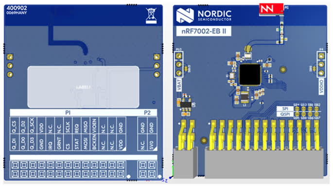

.. _nrf7002eb2:

nRF7002 EB II
#############

Overview
********

The nRF7002 EB II is a versatile evaluation kit in the form of a thumbstick shield which connects to
compatible Nordic host boards using the Nordic edge-connector.

The nRF7002 EB II unlocks low-power Wi-Fi 6 capabilities for your host device. It supports dual-band Wi-Fi
2.4GHz and 5GHz, and is based on the nRF7002 SoC. The shield also supports nRF7001 and nRF7000 SoCs
through variant overlays.
Seamlessly connect to Wi-Fi networks and leverage Wi-Fi-based locationing, enabling advanced
features such as SSID sniffing of local Wi-Fi hubs.

   nRF7002 EB II

Requirements
************

The nRF7002 EB II board is designed to fit straight into a Nordic edge-connector and uses SPI as the
communication interface. Any host board that supports the Nordic edge-connector can be used with
the nRF7002 EB II.

Prerequisites
-------------

The nRF70 driver requires firmware binary blobs for Wi-Fi operation. Run the command
below to retrieve those files.

.. code-block:: console

   west update
   west blobs fetch nrf_wifi

Usage
*****

The shield can be used in any application by setting ``--shield nrf7002eb2`` when invoking ``west build``.

Shield Variants
***************

The nRF7002 EB II has several variants to support different nRF70 SoCs and features:

- ``nrf7002eb2``: The default variant using the nRF7002 SoC.
- ``nrf7002eb2_nrf7001``: Variant using the nRF7001 SoC.
- ``nrf7002eb2_nrf7000``: Variant using the nRF7000 SoC.
- ``nrf7002eb2_coex``: Variant which includes the COEX pins. These pins are not routed to the
  edge-connector on some boards, like earlier revisions of the Thingy53 than v1.0.0.

SR Co-existence
***************

The nRF7002 EB II supports SR co-existence provided the host board supports it. The SR co-existence
pins are connected to the host board's GPIO pins.

Two Kconfig options are available to enable SR co-existence:

- :kconfig:option:`CONFIG_NRF70_SR_COEX`: Enables SR co-existence.
- :kconfig:option:`CONFIG_NRF70_SR_COEX_RF_SWITCH`: Control SR side RF switch.

References
**********

- `Developing with nRF7002 EB II <https://docs.nordicsemi.com/bundle/ncs-latest/page/nrf/app_dev/device_guides/nrf70/nrf7002eb2_dev_guide.html>`_
