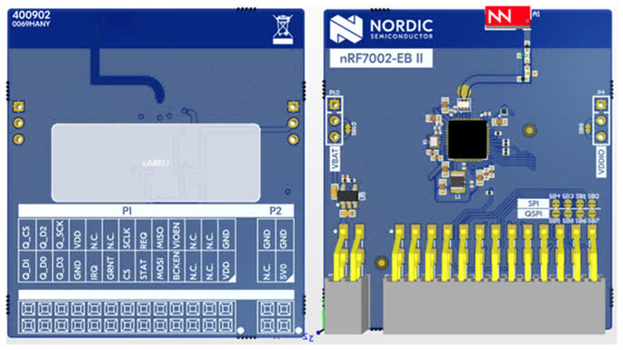

.. _nrf7002eb2:

nRF7002 EB II
#############

Overview
********

The nRF7002 EB II is a versatile evaluation kit in the form of a thumbstick shield which connects to
compatible Nordic host boards using the Nordic expansion header.

The nRF7002 EB II unlocks low-power Wi-Fi 6 capabilities for your host device. It supports dual-band Wi-Fi
2.4GHz and 5GHz, and is based on the nRF7002 SoC. The shield also supports nRF7001 and nRF7000 SoCs
through variant overlays.
Seamlessly connect to Wi-Fi networks and leverage Wi-Fi-based locationing, enabling advanced
features such as SSID sniffing of local Wi-Fi hubs.

   nRF7002 EB II

Requirements
************

The nRF7002 EB II board is designed to fit straight into a Nordic expansion header and uses SPI as the
communication interface. Any host board that supports the Nordic expansion header can be used with
the nRF7002 EB II.

Prerequisites
-------------

The nRF70 driver requires firmware binary blobs for Wi-Fi operation. Run the command
below to retrieve those files.

.. code-block:: console

   west update
   west blobs fetch nrf_wifi

Usage
*****

The shield can be used in any application by setting ``--shield nrf7002eb2`` when invoking
``west build``.

Console and UART impact
***********************

On nRF54L15 DK and nRF54LM20 DK, the expansion header pins conflict with the pins used by
Virtual Serial Port 1 (VCOM1).

Because the application core (CPUAPP) is essential, the shield overlay disables the conflicting
UART20 and reroutes the application console (including shell, mcumgr, and Bluetooth monitor) to
UART30, which maps to VCOM0.

Key changes and requirements
----------------------------

- **Virtual Serial Port Swap**: The application console moves from the secondary port to the
  primary port (the first enumerated VCOM port on your OS). You must use this primary port (e.g.
  the lower-numbered ttyACM on Linux or COM port on Windows) for all shell, flashing, and mcumgr
  tasks.
- **Mandatory Step**: VCOM1 (the secondary port) must be disabled in the
  `nRF Connect Board Configurator
  <https://docs.nordicsemi.com/bundle/nrf-connect-board-configurator/page/index.html>`_ for the
  shield to function.
- **Physical Limitation**: Since VCOM1 is electrically blocked by the shield, only one virtual
  serial port (VCOM0) remains functional.
- **FLPR Core**: Because the application core claims the only functional port (VCOM0), the FLPR
  core has no UART output by default. Even if FLPR is remapped to a different UART instance via
  an overlay, it cannot be routed to the PC via USB unless the application core's console is
  disabled to free up the VCOM0 gateway. As a fallback for FLPR console output when using the
  shield, use the ``rtt-console`` snippet.

UART and port mapping
---------------------

.. list-table:: UART and port mapping with shield
   :header-rows: 1
   :widths: auto

   * - Feature
     - Standard (no shield)
     - With shield attached
   * - App core UART instance
     - UART20
     - UART30
   * - App core virtual serial port
     - Serial port 1
     - Serial port 0
   * - FLPR core UART instance
     - UART30
     - None
   * - FLPR core virtual serial port
     - Serial port 0
     - None
   * - Board configurator
     - All ports enabled
     - Disable VCOM1

.. caution::
   If you have multiple devices connected, identify the primary port for this specific board.
   Using the secondary port (VCOM1) while the shield is attached will cause pin conflicts and
   hardware instability.

Shield Variants
***************

The nRF7002 EB II has several variants to support different nRF70 SoCs and features:

- ``nrf7002eb2``: The default variant using the nRF7002 SoC.
- ``nrf7002eb2_nrf7001``: Variant using the nRF7001 SoC.
- ``nrf7002eb2_nrf7000``: Variant using the nRF7000 SoC.
- ``nrf7002eb2_coex``: Adds SR co-existence pins only. It cannot be used standalone; it extends
  one of the main shields (e.g. ``nrf7002eb2`` or ``nrf7002eb2_nrf7000``) by passing both in a
  single ``--shield`` argument, for example: ``--shield "nrf7002eb2;nrf7002eb2_coex"``.

SR Co-existence
***************

The nRF7002 EB II supports SR co-existence provided the host board supports it. The SR co-existence
pins are connected to the host board's GPIO pins. Enable it by using the ``nrf7002eb2_coex`` shield
together with one of the main shields (see Shield Variants above).

Two Kconfig options are available to enable SR co-existence:

- :kconfig:option:`CONFIG_NRF70_SR_COEX`: Enables SR co-existence.
- :kconfig:option:`CONFIG_NRF70_SR_COEX_RF_SWITCH`: Control SR side RF switch.

References
**********

- `Developing with nRF7002 EB II <https://docs.nordicsemi.com/bundle/ncs-latest/page/nrf/app_dev/device_guides/nrf70/nrf7002eb2_dev_guide.html>`_
