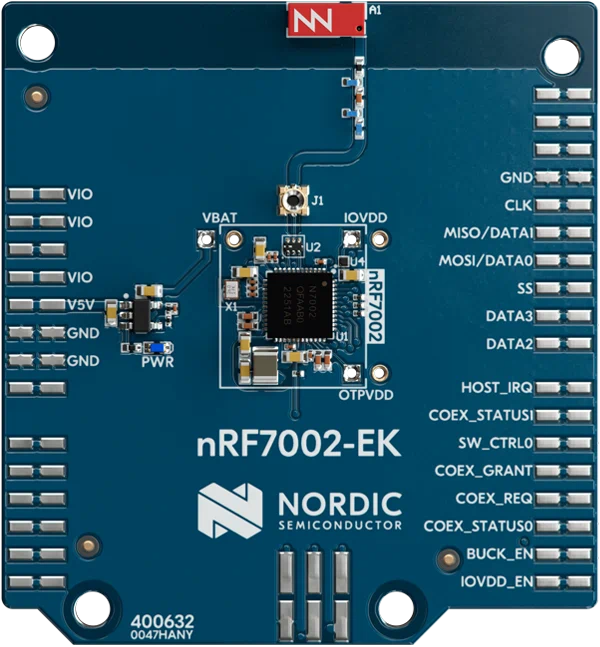

.. _nrf7002ek:

nRF7002 EK
##########

Overview
********

The nRF7002 EK is a versatile evaluation kit in the form of an Arduino shield that can be used in
Nordic and non-Nordic host boards.

The nRF7002 EK unlocks low-power Wi-Fi 6 capabilities for your host device. It support dual-band Wi-Fi
2.4GHz and 5GHz, and is based on the nRF7002 SoC.
Seamlessly connect to Wi-Fi networks and leverage Wi-Fi-based locationing, enabling advanced
features such as SSID sniffing of local Wi-Fi hubs

   nRF7002 EK

Requirements
************

The nRF7002 EK board is designed to fit straight into an Arduino connector and uses SPI as the
communication interface. Any host board that supports the Arduino connector can be used with
the nRF7002 EK.

Prerequisites
-------------

the nRF70 driver requires firmware binary blobs for Wi-Fi operation. Run the command
below to retrieve those files.

.. code-block:: console

   west update
   west blobs fetch hal_nordic

Usage
*****

The shield can be used in any application by setting ``--shield nrf7002ek`` when invoking ``west build``.

SR Co-existence
###############

The nRF7002 EK supports SR co-existence provided the host board supports it. The SR co-existence
pins are connected to the host board's GPIO pins. The interface is selected by setting
``--shield nrf7002ek_coex`` when invoking ``west build``.

Two Kconfig options are available to enable SR co-existence:

- :kconfig:option:`CONFIG_NRF70_SR_COEX`: Enables SR co-existence driver.
- :kconfig:option:`CONFIG_NRF70_SR_COEX_RF_SWITCH`: Control SR side RF switch.

Shield Variants
###############

The nRF7002 EK is available in four variants:

- ``nrf7002ek``: The default variant.
- ``nrf7002ek_nrf7001``: Variant for the nRF7001 SoC or nRF7002 SoC emulating nRF7001
  that supports only 2.4GHz Wi-Fi.
- ``nrf7002ek_nrf7000``: Variant for the nRF7000 SoC or nRF7002 SoC emulating nRF7000
  that supports only 2.4GHz Wi-Fi.
- ``nrf7002ek_coex``: Variant for the SR co-existence interface

References
**********

- `nRF7002 EK product page <https://www.nordicsemi.com/Products/Development-hardware/nRF7002-EK>`_
- `nRF7002 product specification <https://infocenter.nordicsemi.com/index.jsp?topic=%2Fstruct_nrf70%2Fstruct%2Fnrf7002.html&cp=3_0>`_
- `nRF7002 EK Co-existence <https://infocenter.nordicsemi.com/index.jsp?topic=%2Fps_nrf7002%2Fchapters%2Ffunctional%2Fdoc%2Fcoexistence.html&cp=3_0_0_7>`_
