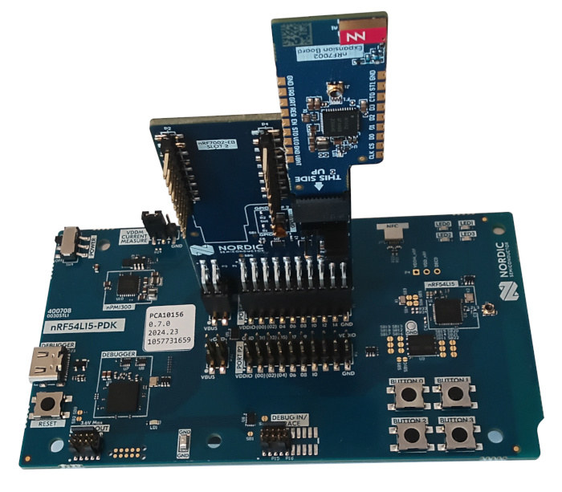

.. _nRF700x_nrf54l15pdk:

nRF700X-nRF54l15PDK
###################

Overview
********

The nRF700X-nRF54l15PDK consists of the following hardware:

- nRF54L15-PDK (Preview Development Kit)
- nRF7002-EB Interposer Board
- nRF7002-EB Wi-Fi shield

   nRF700X-nRF54l15PDK

Hardware setup
**************

Using the nRF700X-nRF54l15PDK figure as reference:

1. Select GPIO MAP 1 using the nRF7002-EB Interposer Board's GPIO SEL DIP switch
2. Disconnect the nRF54L15-PDK from power.
3. Insert the nRF7002-EB Interposer Board's P1 connector to the P1 header of the nRF54L15-PDK.
4. Insert the nRF7002-EB Wi-Fi shield into the nRF7002-EB Interposer Board's SLOT 1.
5. Connect the nRF54L15-PDK to power.

Prerequisites
*************

the nRF70 driver requires firmware binary blobs for Wi-Fi operation. Run the command
below to retrieve those files.

.. code-block:: console

   west update
   west blobs fetch hal_nordic

Usage
*****

Selecting this shield when building for the nRF54L15-PDK configures the SoC to be
optimal for WiFi by disabling the FLPR core and re-allocating its resources to the
application core.

To test the shield, build the WiFi sample using the following command:

.. zephyr-app-commands::
   :tool: west
   :host-os: unix
   :board: nrf54l15pdk/nrf54l15/cpuapp
   :shield: nrf700x_nrf54l15pdk
   :zephyr-app: samples/net/wifi
   :goals: build
