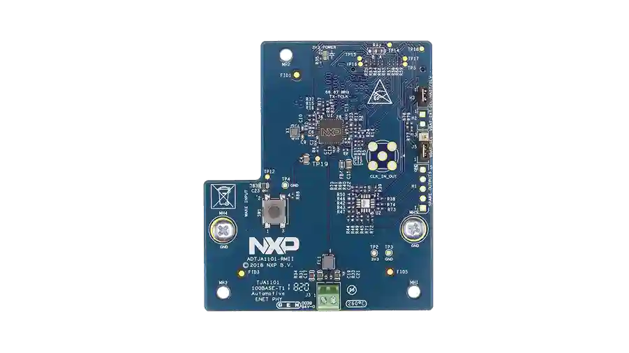

.. _nxp_adtja1101:

NXP ADTJA1101-RMII Automotive Ethernet Adapter
##############################################

Overview
********

The ADTJA1101-RMII is an automotive Ethernet adapter card specifically built to
add 100Mbps automotive Ethernet connectivity to the S32K148 Microcontroller and
i.MX8 platforms.

This shield can be used with the NXP S32K148-Q176 evaluation board by plugging
into the common expansion connector, through which the ADTJA1101-RMII connects
the RMII interfaces of the S32K148 directly to NXP’s 100BASE-T1 Ethernet PHY
TJA1101.

More information about this module can be found at `ADTJA1101-RMII`_.

Programming
***********

Set ``--shield nxp_adtja1101`` when you invoke ``west build``.

References
**********

.. target-notes::

.. _ADTJA1101-RMII:
   https://www.nxp.com/part/ADTJA1101-RMII
