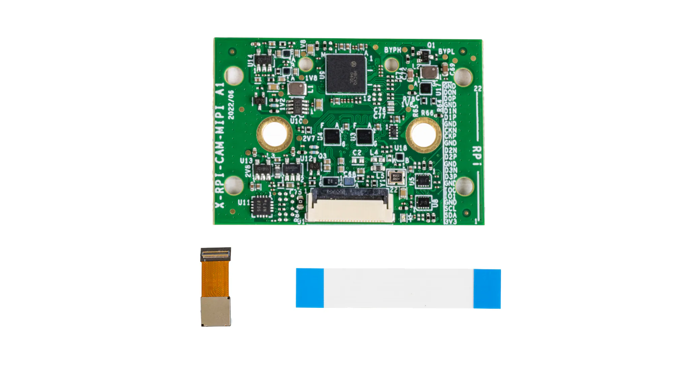

.. _nxp_ias_to_rpi_camera_adapter:

NXP IAS to RPi Camera Adapter
#############################

Overview
********

This shield describes an AP1302-based camera module connected through the
"IAS to RPi Camera Adapter".

The shield is intentionally minimal and only adds the camera sensor device node
(AP1302) and its outgoing CSI-2 endpoint.

Board requirements
******************

Boards using this shield must provide the following devicetree labels:

- ``csi_i2c``: I2C bus connected to the camera module
  (standard Raspberry Pi CSI connector label).
- ``csi_connector``: GPIO nexus providing camera control pins (compatible
  :dtcompatible:`raspberrypi,csi-connector`).
- ``csi_ep_in``: CSI endpoint on the SoC side.

Programming
***********

For example:

.. zephyr-app-commands::
   :zephyr-app: samples/drivers/video/capture
   :board: imx95_evk/mimx9596/m7/ddr
   :shield: nxp_ias_to_rpi_camera_adapter
   :goals: build

References
**********

.. target-notes::

Firmware binaries (AP1302)
==========================

The AP1302 requires a firmware binary blob which is not distributed with Zephyr.
For convenience, the public download repository is:

- https://github.com/ONSemiconductor/ap1302_binaries

.. _NXP IAS TO RPI CAMERA ADAPTER website:
   https://www.nxp.com/design/design-center/development-boards-and-designs/ias-camera-to-rpi-camera-adapter:RPI-CAM-MIPI
