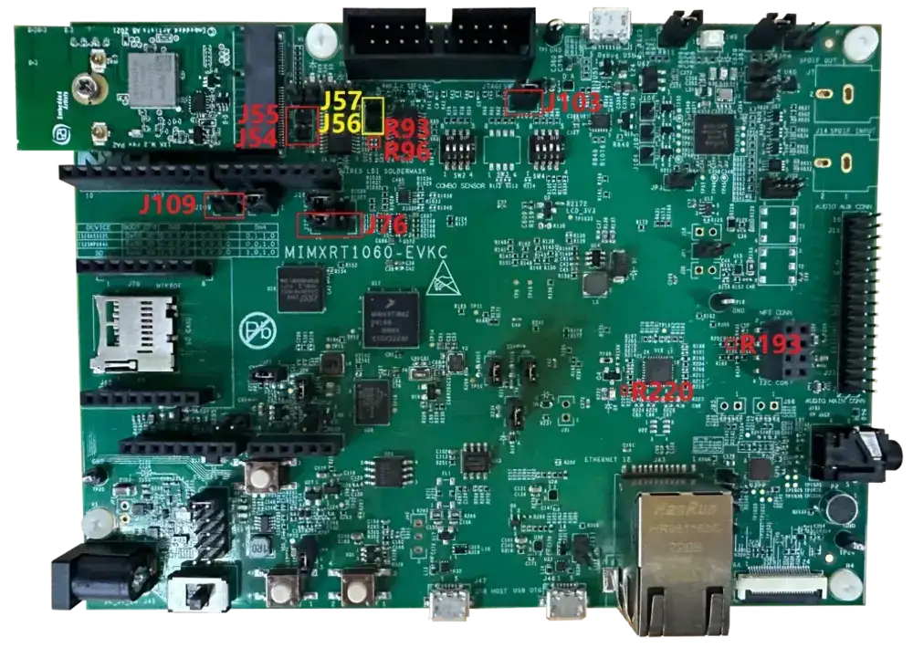

.. _nxp_m2_wifi_bt:

NXP M.2 Wi-Fi and BT Shield
###########################

Overview
********

This Zephyr shield is tested with the following M.2 modules and hardware for Wi-Fi and Bluetooth applications:

- Embedded Artist 1XK module - uses Murata 1XK radio module with NXP IW416 chipset
- Embedded Artist 2EL module - uses Murata 2EL radio module with NXP IW612 chipset

More information about supported chipsets, radio modules and M.2 modules can be found in below links,

- `IW612 NXP Chipset <https://www.nxp.com/products/IW612>`_
- `IW416 NXP Chipset <https://www.nxp.com/products/IW416>`_
- `2EL Murata Radio Module <https://www.murata.com/en-us/products/connectivitymodule/wi-fi-bluetooth/overview/lineup/type2el>`_
- `1XK Murata Radio Module  <https://www.murata.com/en-us/products/connectivitymodule/wi-fi-bluetooth/overview/lineup/type1xk>`_
- `1XK Embedded Artist Module <https://www.embeddedartists.com/products/1xk-m-2-module>`_
- `2EL Embedded Artist Module <https://www.embeddedartists.com/products/2el-m-2-module>`_

Requirements
************

To use the shield, below requirements needs to be satisfied.

- M.2 module with BT HCI UART and SDIO Interface with NXP IW416 or IW612 SoC support.
- Host platform shall have compatible M.2 interface slot.
- For Coex (Wi-Fi + BT), UART driver that supports UART RTS line control to wakeup BT CPU from sleep.
- To use default Bluetooth-Shell app it needs ~490KB flash & ~130KB RAM memory.
- To use default Wi-Fi-Shell app it needs ~1MB flash & ~1.2MB RAM memory.

Integration Platform
********************

This shield is validated and tested for use with the host platform listed below. It can be used with
other host platforms, but the functionality is not guaranteed.

- :zephyr:board:`mimxrt1060_evk` Rev-C.

Fetch Binary Blobs
******************

To support Bluetooth or Wi-Fi, nxp_m2_wifi_bt requires fetching binary blobs,
using the following command:

.. code-block:: console

   west blobs fetch hal_nxp

Programming
***********

Below are the supported shields to be used with ``--shield <option>`` when you invoke
``west build``.

- ``nxp_m2_1xk_wifi_bt``: For Wi-Fi/Bluetooth samples to work with NXP IW416 SoC
- ``nxp_m2_2el_wifi_bt``: For Wi-Fi/Bluetooth samples to work with NXP IW612 SoC

For example:

.. zephyr-app-commands::
   :zephyr-app: samples/bluetooth/handsfree
   :board: mimxrt1060_evk@C//qspi
   :shield: nxp_m2_1xk_wifi_bt
   :goals: build

.. zephyr-app-commands::
   :zephyr-app: samples/net/wifi/shell
   :board: mimxrt1060_evk@C//qspi
   :shield: nxp_m2_2el_wifi_bt
   :goals: build
   :gen-args: -DEXTRA_CONF_FILE="nxp/overlay_hosted_mcu.conf"

.. note::
   To build Wi-Fi application, "nxp/overlay_hosted_mcu.conf" config file
   must be passed along with default conf file as mentioned in above build command.

Hardware Rework to Enable M.2 Interfaces
****************************************

Rework for MIMXRT1060EVK Rev-C
==============================

Bluetooth HCI UART
------------------

- Mount R93, R96.
- Remove R193.
- Connect J109, connect J76 2-3.

I2S For BT SCO
--------------

- Remove J54 and J55, connect J56, and J57.
- Remove R220.
- Connect J103.

.. note::
   When J103 is connected, flash cannot be downloaded. So, remove the connection when downloading flash
   and reconnect it after downloading.

   MIMXRT1060EVK Rev-C BT Rework for M.2 Modules
