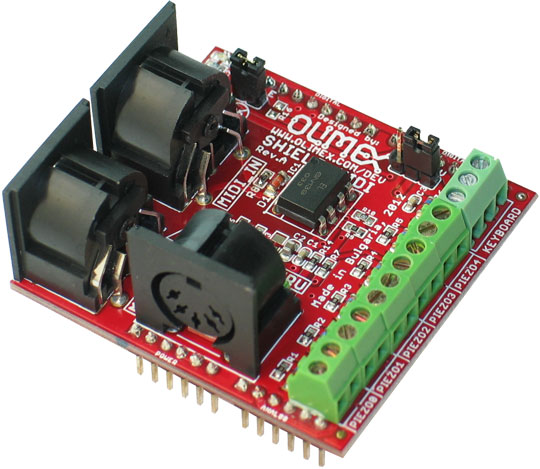

.. _olimex_shield_midi:

Olimex SHIELD-MIDI
##################

Overview
********

This is a MIDI shield which allows Arduino like boards to receive and send MIDI
messages. The shield allows direct wiring of up to 5 piezzo sensors and a
keyboard (with buttons and serial resistors) making it ideal for drums projects.

* MIDI-IN, MIDI-OUT and MIDI-THRU connectors
* 5 Piezzo sensors for drum implementation
* Keyboard for piano implementation
* Works with both 3.3V and 5V Arduino-like boards

More information on the `SHIELD-MIDI website`_.

Peripherals
***********

The following peripherals are available in Zephyr:

- MIDI IN/OUT: on ``midi_serial`` (set at 31.25kb/s)
- leds: ``midi_green_led``, ``midi_red_led``

Programming
***********

Set ``--shield olimex_shield_midi`` when you invoke ``west build``. For example:

.. zephyr-app-commands::
   :zephyr-app: samples/net/midi2
   :board: nucleo_f429zi
   :shield: olimex_shield_midi
   :goals: build

.. _SHIELD-MIDI website:
   https://www.olimex.com/Products/Duino/Shields/SHIELD-MIDI/open-source-hardware
