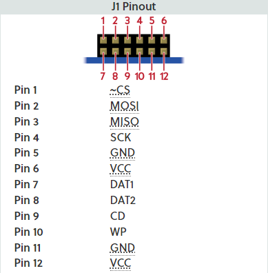

.. _pmod_sd:

Digilent Pmod SD
################

Overview
********

The Digilent Pmod SD (Revision B) allows system boards to read from and write to SD cards.

Features
********

- Full-sized SD card slot
- Store and access large amounts of date from your system board
- No limitation on file system or memory size of SD card used
- 1-bit and 4-bit communication
- 12-pin Pmod port with SPI interface

Programming
***********

Set ``--shield pmod_sd`` when you invoke ``west build``. For example:

.. zephyr-app-commands::
   :zephyr-app: tests/drivers/disk/disk_access
   :board: ek_ra8m1
   :shield: pmod_sd
   :goals: build

Pinout
======

	PMOD SD Pinout (Credit: Digilent)

References
**********

- `Pmod SD product page`_
- `Pmod SD reference manual`_
- `Pmod SD schematic`_

.. _Pmod SD product page:
   https://digilent.com/shop/pmod-sd-full-sized-sd-card-slot/

.. _Pmod SD reference manual:
   https://digilent.com/reference/pmod/pmodsd/reference-manual

.. _Pmod SD schematic:
   https://digilent.com/reference/_media/reference/pmod/pmodsd/pmodsd_sch.pdf
