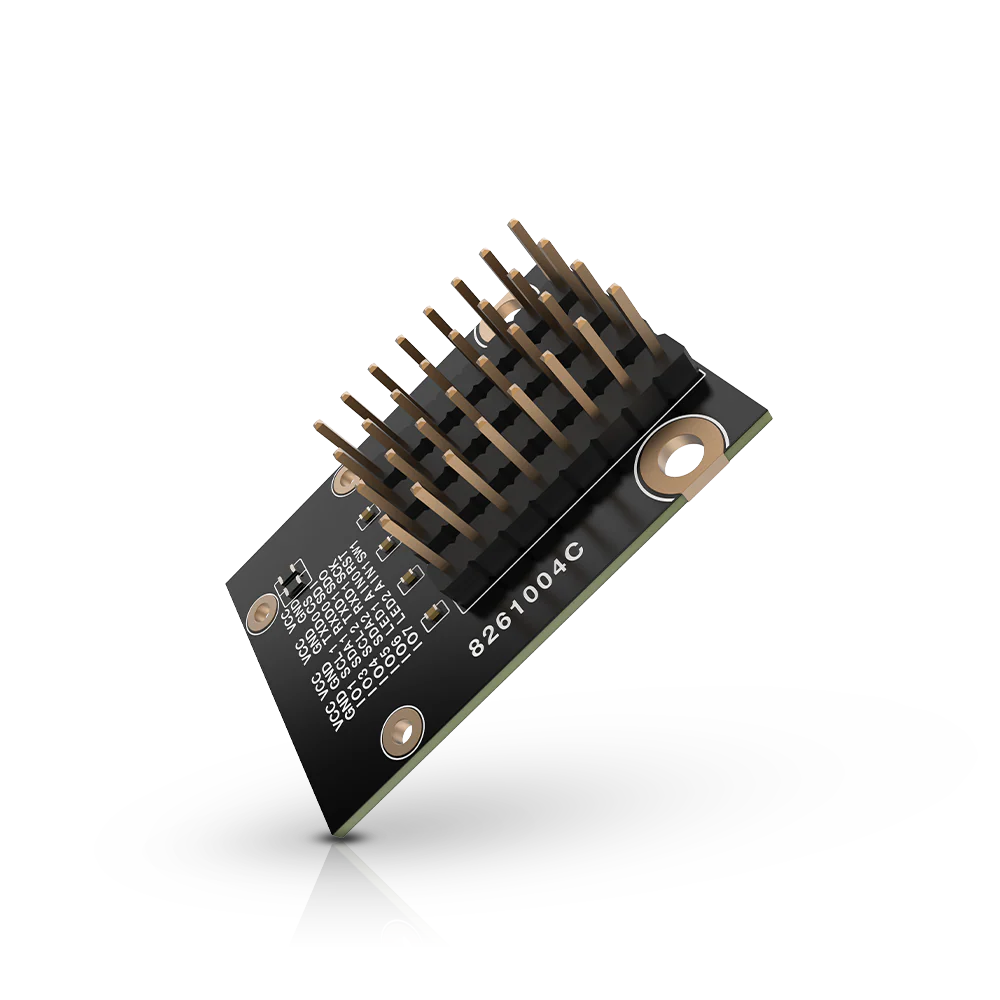

.. _rakwireless_rak13002:

RAK13002 WisBlock IO Module
###########################

Overview
********

The RAK13002 is a WisBlock Core adaptor module that
can be mounted to the IO slot of the WisBlock Base
board. This module exposed all WisBlock Core signals
such as I2C, SPI, UART, GPIO, and ADC to
standard 2.54 mm pitch pin header for easy integration
of external components and devices.

   RAK13002 WisBlock IO Module (Credit: RAKwireless)

Product Features
****************

- Supports two I2C interfaces
- Supports two UART interfaces
- Supports one SPI interface
- Supports up to six (6) GPIOs
- Supports two (2) ADC interfaces
- 3.3 V power supply interfaces
- Backup battery (super cap) can keep the RTC running for up to 7 days (tested in lab)
- Module size: 25X35 mm

More information about the shield can be found at
`RAK13002 WisBlock IO Module`_.

Requirements
************

To use a RAK13002, you need at least a WisBlock Base to plug the module in.
WisBlock Base is the power supply for the RAK13002 module. Furthermore,
you need a WisBlock Core module to use the RAK13002.

Mounting
********

The RAK13002 module can be mounted on the IO slot of a WisBlock Base board.

The mounting guide for RAK13002 can be found at `RAK13002 WisBlock Assembly Guide`_.

Pin Assignments
***************

WisBlock IO Slot Pin Assignments

+-------------+----------+-----+-----+----------+-------------+
| Used        | A        | Pin | Pin | A        | Used        |
+-------------+----------+-----+-----+----------+-------------+
|             | VBAT     | 1   | 2   | VBAT     |             |
+-------------+----------+-----+-----+----------+-------------+
|             | GND      | 3   | 4   | GND      |             |
+-------------+----------+-----+-----+----------+-------------+
|             | 3V3      | 5   | 6   | 3V3      |             |
+-------------+----------+-----+-----+----------+-------------+
|             | USB_P    | 7   | 8   | USB_N    |             |
+-------------+----------+-----+-----+----------+-------------+
|             | VBUS     | 9   | 10  | SW1      | SW1         |
+-------------+----------+-----+-----+----------+-------------+
| TXD0        | TXD0     | 11  | 12  | RXD0     | RXD0        |
+-------------+----------+-----+-----+----------+-------------+
| RESET       | RESET    | 13  | 14  | LED1     | LED1        |
+-------------+----------+-----+-----+----------+-------------+
| LED2        | LED2     | 15  | 16  | LED3     |             |
+-------------+----------+-----+-----+----------+-------------+
|             | VDD      | 17  | 18  | VDD      |             |
+-------------+----------+-----+-----+----------+-------------+
| SDA1        | I2C1_SDA | 19  | 20  | I2C1_SCL | SCL1        |
+-------------+----------+-----+-----+----------+-------------+
| AIN0        | AIN0     | 21  | 22  | AIN1     | AIN1        |
+-------------+----------+-----+-----+----------+-------------+
|             | BOOT0    | 23  | 24  | IO7      | IO7         |
+-------------+----------+-----+-----+----------+-------------+
| CS          | SPI_CS   | 25  | 26  | SPI_CLK  | SCK         |
+-------------+----------+-----+-----+----------+-------------+
| SDI         | SPI_MISO | 27  | 28  | SPI_MOSI | SDO         |
+-------------+----------+-----+-----+----------+-------------+
| IO1         | IO1      | 29  | 30  | IO2      |             |
+-------------+----------+-----+-----+----------+-------------+
| IO3         | IO3      | 31  | 32  | IO4      | IO4         |
+-------------+----------+-----+-----+----------+-------------+
| TXD         | TXD1     | 33  | 34  | RXD1     | RXD         |
+-------------+----------+-----+-----+----------+-------------+
| SDA2        | I2C2_SDA | 35  | 36  | I2C2_SCL | SCL2        |
+-------------+----------+-----+-----+----------+-------------+
| IO5         | IO5      | 37  | 38  | IO6      | IO6         |
+-------------+----------+-----+-----+----------+-------------+
|             | GND      | 39  | 40  | GND      |             |
+-------------+----------+-----+-----+----------+-------------+

Programming
***********

Set ``--shield rakwireless_rak13002`` when you invoke ``west build``,
for example:

.. zephyr-app-commands::
   :zephyr-app: samples/hello_world
   :board: rak11310/rp2040
   :shield: rakwireless_rak19007,rakwireless_rak13002
   :goals: build flash

References
**********

.. target-notes::

.. _RAK13002 WisBlock Assembly Guide:
   https://docs.rakwireless.com/product-categories/wisblock/rak13002/quickstart/#assembling

.. _RAK13002 WisBlock IO Module:
   https://docs.rakwireless.com/product-categories/wisblock/rak13002/overview
