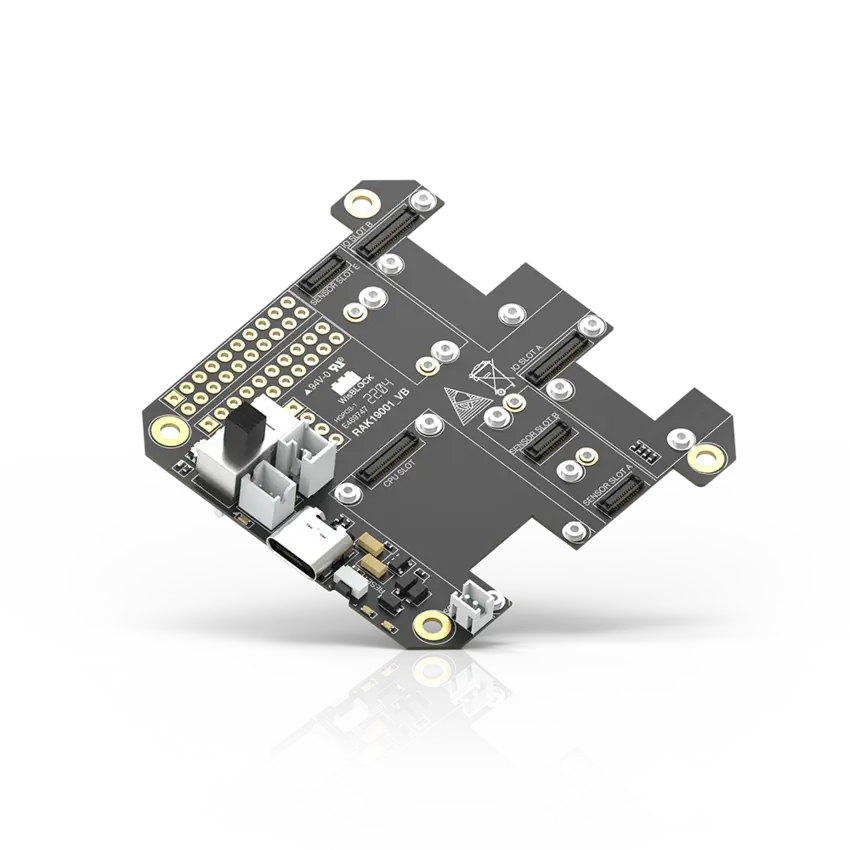
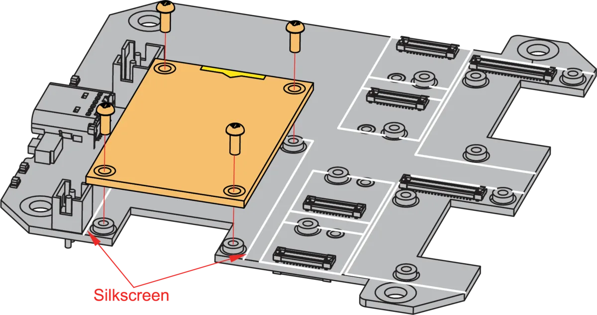

.. _rakwireless_rak19001:

RAK19001 WisBlock Dual IO Base Board
####################################

Overview
********

RAK19001 is a WisBlock Base board that connects WisBlock Core and WisBlock Modules.
It provides the power supply and interconnection to the modules attached to it. It
has one slot reserved for the WisBlock Core module, two IO slots, and six sensor
slots A to F for WisBlock Modules. Also, there are two 2.54 mm pitch headers that
expose all key input-output pins of the WisBlock Core that includes UART, I2C, SPI,
and many IO Pins.

For convenience, there is a Type-C USB connector that is connected directly to WisBlock
Core MCU’s USB port (if supported) or to a USB-UART converter depending on the WisBlock
Core. The USB-C connection can be used for uploading firmware, serial communication,
and charging a rechargeable battery. RAK19001 also includes a slide switch to select
between rechargeable and non-rechargeable batteries.

WisBlock Modules are connected to the RAK19001 WisBlock Base board via high-speed
board-to-board connectors. They provide secure and reliable interconnection to ensure
the signal integrity of each data bus. A set of screws are used for fixing the modules,
which makes it reliable even in an environment with lots of vibrations.

Additionally, it has two user-definable LEDs, one power supply/charging indicator LED,
and one user-defined button.

   RAK19001 WisBlock Dual IO Base Board (Credit: RAKwireless)

Product Features
****************

- Flexible building block design, which enables modular functionality and expansion
- High-speed interconnection connectors in the WisBlock Base board to ensure signal integrity
- Multiple Headers and Modules Slots for WisBlock Modules
   - Two (2) IO slots
   - Six (6) Sensor (A to F) slots
   - All key input-output pins of WisBlock Core are exposed via headers
   - Access to various communication bus via headers: I2C, SPI, UART, and USB
   - One user-defined push button switch
- Power supply
   - Supports both 5 V USB, 3.7 V rechargeable battery, and 3.3 to 5.5 V non-rechargeable battery as power supply
   - The power supply for the WisBlock modules boards can be controlled by the WisBlock Core modules to minimize power consumption
   - Slide switch to select between a rechargeable or non-rechargeable battery
- Size
   - 60 x 67 mm

More information about the shield can be found at
`RAK19001 WisBlock Dual IO Base Board`_.

Requirements
************

RAK19001 WisBlock Dual IO Base Board requires a WisBlock Core module to operate. It is
compatible with almost all WisBlock Core modules, but the features available depend on
the specific WisBlock Core module used.

Mounting
********

WisBlock Core modules are mounted on the RAK19001 WisBlock Base board using the 40-pin header,
called WisBlock I/O connector. It is compatible with the WisBlock ecosystem, allowing for easy
integration with various WisBlock modules and sensors.

The mounting guides for RAK19001 can be found at `RAK19001 WisBlock Base Board Installation Guide`_.

Pin Assignments
***************

WisBlock IO Connector Pin Assignments

+----------+-----+-----+----------+
| Function | Pin | Pin | Function |
+==========+=====+=====+==========+
| VBAT     | 1   | 2   | VBAT     |
+----------+-----+-----+----------+
| GND      | 3   | 4   | GND      |
+----------+-----+-----+----------+
| 3V3      | 5   | 6   | 3V3      |
+----------+-----+-----+----------+
| USB_P    | 7   | 8   | USB_N    |
+----------+-----+-----+----------+
| VBUS     | 9   | 10  | SW1      |
+----------+-----+-----+----------+
| TXD0     | 11  | 12  | RXD0     |
+----------+-----+-----+----------+
| RESET    | 13  | 14  | LED1     |
+----------+-----+-----+----------+
| LED2     | 15  | 16  | LED3     |
+----------+-----+-----+----------+
| VDD      | 17  | 18  | VDD      |
+----------+-----+-----+----------+
| I2C1_SDA | 19  | 20  | I2C1_SCL |
+----------+-----+-----+----------+
| AIN0     | 21  | 22  | AIN1     |
+----------+-----+-----+----------+
| BOOT0    | 23  | 24  | IO7      |
+----------+-----+-----+----------+
| SPI_CS   | 25  | 26  | SPI_CLK  |
+----------+-----+-----+----------+
| SPI_MISO | 27  | 28  | SPI_MOSI |
+----------+-----+-----+----------+
| IO1      | 29  | 30  | IO2      |
+----------+-----+-----+----------+
| IO3      | 31  | 32  | IO4      |
+----------+-----+-----+----------+
| TXD1     | 33  | 34  | RXD1     |
+----------+-----+-----+----------+
| I2C2_SDA | 35  | 36  | I2C2_SCL |
+----------+-----+-----+----------+
| IO5      | 37  | 38  | IO6      |
+----------+-----+-----+----------+
| GND      | 39  | 40  | GND      |
+----------+-----+-----+----------+

WisBlock Sensor Slot A-C Pin Assignments

+----------+----------+----------+-----+-----+----------+----------+----------+
| C        | B        | A        | Pin | Pin | A        | B        | C        |
+==========+==========+==========+=====+=====+==========+==========+==========+
| NC       | NC       | TXD0     | 1   | 2   | GND      | GND      | GND      |
+----------+----------+----------+-----+-----+----------+----------+----------+
| SPI_CS   | SPI_CS   | SPI_CS   | 3   | 4   | SPI_CS   | SPI_CS   | SPI_CS   |
+----------+----------+----------+-----+-----+----------+----------+----------+
| SPI_MISO | SPI_MISO | SPI_MISO | 5   | 6   | SPI_MOSI | SPI_MOSI | SPI_MOSI |
+----------+----------+----------+-----+-----+----------+----------+----------+
| I2C1_SCL | I2C1_SCL | I2C1_SCL | 7   | 8   | I2C1_SDA | I2C1_SDA | I2C1_SDA |
+----------+----------+----------+-----+-----+----------+----------+----------+
| VDD      | VDD      | VDD      | 9   | 10  | IO2      | IO1      | IO4      |
+----------+----------+----------+-----+-----+----------+----------+----------+
| 3V3      | 3V3      | 3V3      | 11  | 12  | IO1      | IO2      | IO3      |
+----------+----------+----------+-----+-----+----------+----------+----------+
| NC       | NC       | NC       | 13  | 14  | 3V3      | 3V3      | 3V3      |
+----------+----------+----------+-----+-----+----------+----------+----------+
| NC       | NC       | NC       | 15  | 16  | VDD      | VDD      | VDD      |
+----------+----------+----------+-----+-----+----------+----------+----------+
| NC       | NC       | NC       | 17  | 18  | NC       | NC       | NC       |
+----------+----------+----------+-----+-----+----------+----------+----------+
| NC       | NC       | NC       | 19  | 20  | NC       | NC       | NC       |
+----------+----------+----------+-----+-----+----------+----------+----------+
| NC       | NC       | NC       | 21  | 22  | NC       | NC       | NC       |
+----------+----------+----------+-----+-----+----------+----------+----------+
| GND      | GND      | GND      | 19  | 20  | RXD0     | NC       | NC       |
+----------+----------+----------+-----+-----+----------+----------+----------+

WisBlock Sensor Slot D-F Pin Assignments

+----------+----------+----------+-----+-----+----------+----------+----------+
| F        | E        | D        | Pin | Pin | D        | E        | F        |
+==========+==========+==========+=====+=====+==========+==========+==========+
| TXD1     | TXD0     | NC       | 1   | 2   | GND      | GND      | GND      |
+----------+----------+----------+-----+-----+----------+----------+----------+
| SPI_CS   | SPI_CS   | SPI_CS   | 3   | 4   | SPI_CS   | SPI_CS   | SPI_CS   |
+----------+----------+----------+-----+-----+----------+----------+----------+
| SPI_MISO | SPI_MISO | SPI_MISO | 5   | 6   | SPI_MOSI | SPI_MOSI | SPI_MOSI |
+----------+----------+----------+-----+-----+----------+----------+----------+
| I2C1_SCL | I2C1_SCL | I2C1_SCL | 7   | 8   | I2C1_SDA | I2C1_SDA | I2C1_SDA |
+----------+----------+----------+-----+-----+----------+----------+----------+
| VDD      | VDD      | VDD      | 9   | 10  | IO6      | IO3      | IO5      |
+----------+----------+----------+-----+-----+----------+----------+----------+
| 3V3      | 3V3      | 3V3      | 11  | 12  | IO5      | IO4      | IO6      |
+----------+----------+----------+-----+-----+----------+----------+----------+
| NC       | NC       | NC       | 13  | 14  | 3V3      | 3V3      | 3V3      |
+----------+----------+----------+-----+-----+----------+----------+----------+
| NC       | NC       | NC       | 15  | 16  | VDD      | VDD      | VDD      |
+----------+----------+----------+-----+-----+----------+----------+----------+
| NC       | NC       | NC       | 17  | 18  | NC       | NC       | NC       |
+----------+----------+----------+-----+-----+----------+----------+----------+
| NC       | NC       | NC       | 19  | 20  | NC       | NC       | NC       |
+----------+----------+----------+-----+-----+----------+----------+----------+
| NC       | NC       | NC       | 21  | 22  | NC       | NC       | NC       |
+----------+----------+----------+-----+-----+----------+----------+----------+
| GND      | GND      | GND      | 19  | 20  | NC       | RXD0     | RXD1     |
+----------+----------+----------+-----+-----+----------+----------+----------+

Programming
***********

Set ``--shield rakwireless_rak19001`` when you invoke ``west build``,
for example:

.. zephyr-app-commands::
   :zephyr-app: samples/drivers/fuel_gauge
   :board: rak4631/nrf52840
   :shield: rakwireless_rak19001
   :goals: build flash

References
**********

.. target-notes::

.. _RAK19001 WisBlock Dual IO Base Board:
   https://docs.rakwireless.com/product-categories/wisblock/rak19001

.. _RAK19001 WisBlock Base Board Installation Guide:
   https://docs.rakwireless.com/product-categories/wisblock/rak19001/quickstart/#assembling-a-wisblock-module
