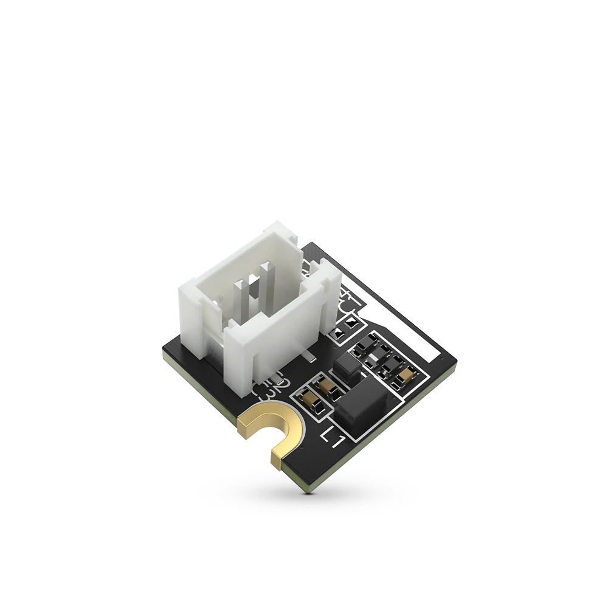

.. _rakwireless_rak19002:

RAK19002 WisBlock Boost Module
##############################

Overview
********

The RAK19002 is a step-up boost regulator module, part of
the RAKwireless WisBlock Series. The module can supply
12 V/50 mA and could be mounted on WisSensor slot of
RAK19007. The output voltage of the module is controlled
by WisBlock Core IO pin.

   RAK19002 WisBlock Boost Module (Credit: RAKwireless)

Product Features
****************

- TPS61046 step-up boost converter
- Input voltage: 3.3 V
- Output voltage: 12 V
- Up to 85% efficiency at 3.6 V input and 12 V output
- ±2 % output voltage accuracy
- 50 mA output current
- Chipset: Texas Instruments TPS61046
- Module size: 10 x 10 mm

More information about the shield can be found at
`RAK19002 WisBlock Boost Module`_.

Requirements
************

To use a RAK19002, you need at least a WisBlock Base to
plug the module in. Furthermore, you need a WisBlock
Core module IO pin to control the Booster Converter.

Mounting
********

The RAK19002 module can be mounted on the slots A, B, C or D of the WisBase board.

The mounting guide for RAK19002 can be found at `RAK19002 WisBlock Assembly Guide`_.

Pin Assignments
***************

WisBlock Sensor Slot A-C Pin Assignments

+-------------+----------+----------+----------+-----+-----+----------+----------+----------+-------------+
| Used        | C        | B        | A        | Pin | Pin | A        | B        | C        | Used        |
+-------------+----------+----------+----------+-----+-----+----------+----------+----------+-------------+
|             | NC       | NC       | TXD0     | 1   | 2   | GND      | GND      | GND      |             |
+-------------+----------+----------+----------+-----+-----+----------+----------+----------+-------------+
|             | SPI_CS   | SPI_CS   | SPI_CS   | 3   | 4   | SPI_CS   | SPI_CS   | SPI_CS   |             |
+-------------+----------+----------+----------+-----+-----+----------+----------+----------+-------------+
|             | SPI_MISO | SPI_MISO | SPI_MISO | 5   | 6   | SPI_MOSI | SPI_MOSI | SPI_MOSI |             |
+-------------+----------+----------+----------+-----+-----+----------+----------+----------+-------------+
|             | I2C1_SCL | I2C1_SCL | I2C1_SCL | 7   | 8   | I2C1_SDA | I2C1_SDA | I2C1_SDA |             |
+-------------+----------+----------+----------+-----+-----+----------+----------+----------+-------------+
|             | VDD      | VDD      | VDD      | 9   | 10  | IO2      | IO1      | IO4      |             |
+-------------+----------+----------+----------+-----+-----+----------+----------+----------+-------------+
|             | 3V3      | 3V3      | 3V3      | 11  | 12  | IO1      | IO2      | IO3      | EN          |
+-------------+----------+----------+----------+-----+-----+----------+----------+----------+-------------+
|             | NC       | NC       | NC       | 13  | 14  | 3V3      | 3V3      | 3V3      |             |
+-------------+----------+----------+----------+-----+-----+----------+----------+----------+-------------+
|             | NC       | NC       | NC       | 15  | 16  | VDD      | VDD      | VDD      |             |
+-------------+----------+----------+----------+-----+-----+----------+----------+----------+-------------+
|             | NC       | NC       | NC       | 17  | 18  | NC       | NC       | NC       |             |
+-------------+----------+----------+----------+-----+-----+----------+----------+----------+-------------+
|             | NC       | NC       | NC       | 19  | 20  | NC       | NC       | NC       |             |
+-------------+----------+----------+----------+-----+-----+----------+----------+----------+-------------+
|             | NC       | NC       | NC       | 21  | 22  | NC       | NC       | NC       |             |
+-------------+----------+----------+----------+-----+-----+----------+----------+----------+-------------+
|             | GND      | GND      | GND      | 23  | 24  | RXD0     | NC       | NC       |             |
+-------------+----------+----------+----------+-----+-----+----------+----------+----------+-------------+

WisBlock Sensor Slot D-F Pin Assignments

+------------+----------+----------+----------+-----+-----+----------+----------+----------+------------+
| Used       | F        | E        | D        | Pin | Pin | D        | E        | F        | Used       |
+------------+----------+----------+----------+-----+-----+----------+----------+----------+------------+
|            | TXD1     | TXD0     | NC       | 1   | 2   | GND      | GND      | GND      |            |
+------------+----------+----------+----------+-----+-----+----------+----------+----------+------------+
|            | SPI_CS   | SPI_CS   | SPI_CS   | 3   | 4   | SPI_CS   | SPI_CS   | SPI_CS   |            |
+------------+----------+----------+----------+-----+-----+----------+----------+----------+------------+
|            | SPI_MISO | SPI_MISO | SPI_MISO | 5   | 6   | SPI_MOSI | SPI_MOSI | SPI_MOSI |            |
+------------+----------+----------+----------+-----+-----+----------+----------+----------+------------+
|            | I2C1_SCL | I2C1_SCL | I2C1_SCL | 7   | 8   | I2C1_SDA | I2C1_SDA | I2C1_SDA |            |
+------------+----------+----------+----------+-----+-----+----------+----------+----------+------------+
|            | VDD      | VDD      | VDD      | 9   | 10  | IO6      | IO3      | IO5      |            |
+------------+----------+----------+----------+-----+-----+----------+----------+----------+------------+
|            | 3V3      | 3V3      | 3V3      | 11  | 12  | IO5      | IO4      | IO6      | EN         |
+------------+----------+----------+----------+-----+-----+----------+----------+----------+------------+
|            | NC       | NC       | NC       | 13  | 14  | 3V3      | 3V3      | 3V3      |            |
+------------+----------+----------+----------+-----+-----+----------+----------+----------+------------+
|            | NC       | NC       | NC       | 15  | 16  | VDD      | VDD      | VDD      |            |
+------------+----------+----------+----------+-----+-----+----------+----------+----------+------------+
|            | NC       | NC       | NC       | 17  | 18  | NC       | NC       | NC       |            |
+------------+----------+----------+----------+-----+-----+----------+----------+----------+------------+
|            | NC       | NC       | NC       | 19  | 20  | NC       | NC       | NC       |            |
+------------+----------+----------+----------+-----+-----+----------+----------+----------+------------+
|            | NC       | NC       | NC       | 21  | 22  | NC       | NC       | NC       |            |
+------------+----------+----------+----------+-----+-----+----------+----------+----------+------------+
|            | GND      | GND      | GND      | 23  | 24  | NC       | RXD0     | RXD1     |            |
+------------+----------+----------+----------+-----+-----+----------+----------+----------+------------+

Programming
***********

Set ``--shield rakwireless_rak19002_sensor_<a-f>`` when you invoke ``west build``,
for example:

.. zephyr-app-commands::
   :zephyr-app: samples/regulator/regulator_shell
   :board: rak4631/nrf52840
   :shield: rakwireless_rak19007,rakwireless_rak19002_sensor_a
   :goals: build flash

References
**********

.. target-notes::

.. _RAK19002 WisBlock Assembly Guide:
   https://docs.rakwireless.com/product-categories/wisblock/rak19002/quickstart/#assembling-a-wisblock-module

.. _RAK19002 WisBlock Boost Module:
   https://docs.rakwireless.com/product-categories/wisblock/rak19002/overview
