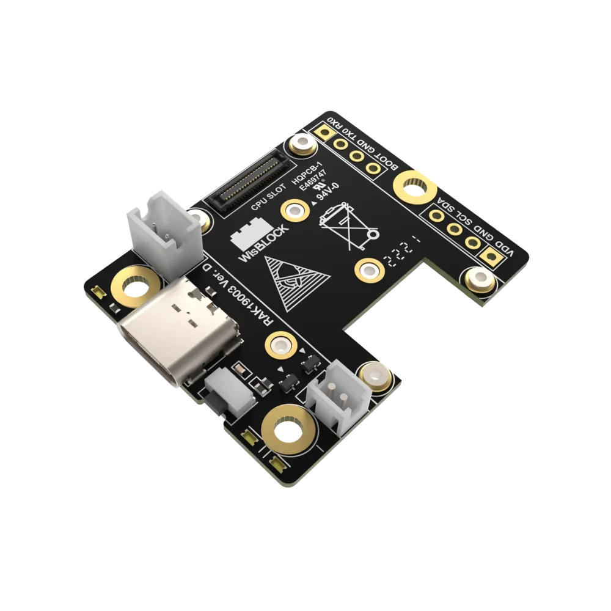

.. _rakwireless_rak19003:

RAK19003 WisBlock Mini Base Board
#################################

Overview
********

RAK19003 is a WisBlock Base board that connects WisBlock Core and WisBlock
Modules. It provides the power supply and interconnection to the modules attached
to it. It has one slot reserved for the WisBlock Core module and two Slot C-D for
WisBlock Modules. The WisBlock Core is attached on the top side, and the WisBlock
Modules are attached to the bottom side of the RAK19003 WisBlock Base board. Slot
D holds modules up to 23 mm in size, while Slot C supports 10 mm WisBlock Modules.
Also, there are two 2.54 mm pitch headers for extension interface with BOOT, I2C,
and UART pins.

For convenience, there is a Type-C USB connector that is connected directly to
WisBlock Core MCU’s USB port (if supported) or to a USB-UART converter depending
on the WisBlock Core. It can be used for uploading firmware or serial communication.
The USB-C connector is also used as a battery charging port.

WisBlock Modules are connected to the RAK19003 WisBlock Base board via high-speed
board to board connectors. They provide secure and reliable interconnection to
ensure the signal integrity of each data bus. A set of screws are used for fixing
the modules, which makes it reliable even in an environment with lots of vibrations.

Using RAK19003 as your WisBlock Base board, you can make your project compact,
which is ideal in small enclosures. You can also use a RAK19005 WisBlock Sensor
Extension Cable to position WisBlock Modules apart from the WisBlock Base board
or in any part of your case.

   RAK19003 WisBlock Mini Base Board (Credit: RAKwireless)

Product Features
****************

- Power supply
   - Supports both 5 V USB and 3.7 V rechargeable battery as power supply.
   - Has a connector for a 5 V solar panel to recharge the battery in a remote solution.
   - Control of power consumption
   - Has an electronic load switch to power the WisBlock modules. The power supply for the WisBlock modules boards can be controlled by the WisBlock Core modules application.
- Size
   - A compact size of 30 x 35 mm, which lets you create solutions that fit into smallest housings.

More information about the shield can be found at
`RAK19003 WisBlock Mini Base Board`_.

Requirements
************

RAK19003 WisBlock Mini Base Board requires a WisBlock Core module to operate. It is
compatible with almost all WisBlock Core modules, but the features available depend on
the specific WisBlock Core module used.

Mounting
********

WisBlock Core modules are mounted on the RAK19003 WisBlock Mini Base board using the 40-pin header,
called WisBlock I/O connector. It is compatible with the WisBlock ecosystem, allowing for easy
integration with various WisBlock modules and sensors.

The mounting guides for RAK19003 can be found at `RAK19003 WisBlock Mini Base Board Installation Guide`_.

Pin Assignments
***************

WisBlock IO Connector Pin Assignments

+----------+-----+-----+----------+
| Function | Pin | Pin | Function |
+----------+-----+-----+----------+
| VBAT     | 1   | 2   | VBAT     |
+----------+-----+-----+----------+
| GND      | 3   | 4   | GND      |
+----------+-----+-----+----------+
| 3V3      | 5   | 6   | 3V3      |
+----------+-----+-----+----------+
| USB_P    | 7   | 8   | USB_N    |
+----------+-----+-----+----------+
| VBUS     | 9   | 10  | SW1      |
+----------+-----+-----+----------+
| TXD0     | 11  | 12  | RXD0     |
+----------+-----+-----+----------+
| RESET    | 13  | 14  | LED1     |
+----------+-----+-----+----------+
| LED2     | 15  | 16  | LED3     |
+----------+-----+-----+----------+
| VDD      | 17  | 18  | VDD      |
+----------+-----+-----+----------+
| I2C1_SDA | 19  | 20  | I2C1_SCL |
+----------+-----+-----+----------+
| AIN0     | 21  | 22  | AIN1     |
+----------+-----+-----+----------+
| BOOT0    | 23  | 24  | IO7      |
+----------+-----+-----+----------+
| SPI_CS   | 25  | 26  | SPI_CLK  |
+----------+-----+-----+----------+
| SPI_MISO | 27  | 28  | SPI_MOSI |
+----------+-----+-----+----------+
| IO1      | 29  | 30  | IO2      |
+----------+-----+-----+----------+
| IO3      | 31  | 32  | IO4      |
+----------+-----+-----+----------+
| TXD1     | 33  | 34  | RXD1     |
+----------+-----+-----+----------+
| I2C2_SDA | 35  | 36  | I2C2_SCL |
+----------+-----+-----+----------+
| IO5      | 37  | 38  | IO6      |
+----------+-----+-----+----------+
| GND      | 39  | 40  | GND      |
+----------+-----+-----+----------+

WisBlock Sensor Slot C-D Pin Assignments

+----------+----------+-----+-----+----------+----------+
| D        | C        | Pin | Pin | C        | D        |
+----------+----------+-----+-----+----------+----------+
| NC       | NC       | 1   | 2   | GND      | GND      |
+----------+----------+-----+-----+----------+----------+
| SPI_CS   | SPI_CS   | 3   | 4   | SPI_CS   | SPI_CS   |
+----------+----------+-----+-----+----------+----------+
| SPI_MISO | SPI_MISO | 5   | 6   | SPI_MOSI | SPI_MOSI |
+----------+----------+-----+-----+----------+----------+
| I2C1_SCL | I2C1_SCL | 7   | 8   | I2C1_SDA | I2C1_SDA |
+----------+----------+-----+-----+----------+----------+
| VDD      | VDD      | 9   | 10  | IO4      | IO6      |
+----------+----------+-----+-----+----------+----------+
| 3V3      | 3V3      | 11  | 12  | IO3      | IO5      |
+----------+----------+-----+-----+----------+----------+
| NC       | NC       | 13  | 14  | 3V3      | 3V3      |
+----------+----------+-----+-----+----------+----------+
| NC       | NC       | 15  | 16  | VDD      | VDD      |
+----------+----------+-----+-----+----------+----------+
| NC       | NC       | 17  | 18  | NC       | NC       |
+----------+----------+-----+-----+----------+----------+
| NC       | NC       | 19  | 20  | NC       | NC       |
+----------+----------+-----+-----+----------+----------+
| NC       | NC       | 21  | 22  | NC       | NC       |
+----------+----------+-----+-----+----------+----------+
| GND      | GND      | 19  | 20  | NC       | NC       |
+----------+----------+-----+-----+----------+----------+

Programming
***********

Set ``--shield rakwireless_rak19003`` when you invoke ``west build``,
for example:

.. zephyr-app-commands::
   :zephyr-app: samples/drivers/fuel_gauge
   :board: rak4631/nrf52840
   :shield: rakwireless_rak19003
   :goals: build flash

References
**********

.. target-notes::

.. _RAK19003 WisBlock Mini Base Board:
   https://docs.rakwireless.com/product-categories/wisblock/rak19003

.. _RAK19003 WisBlock Mini Base Board Installation Guide:
   https://docs.rakwireless.com/product-categories/wisblock/rak19003/quickstart/#assembling-a-wisblock-module
