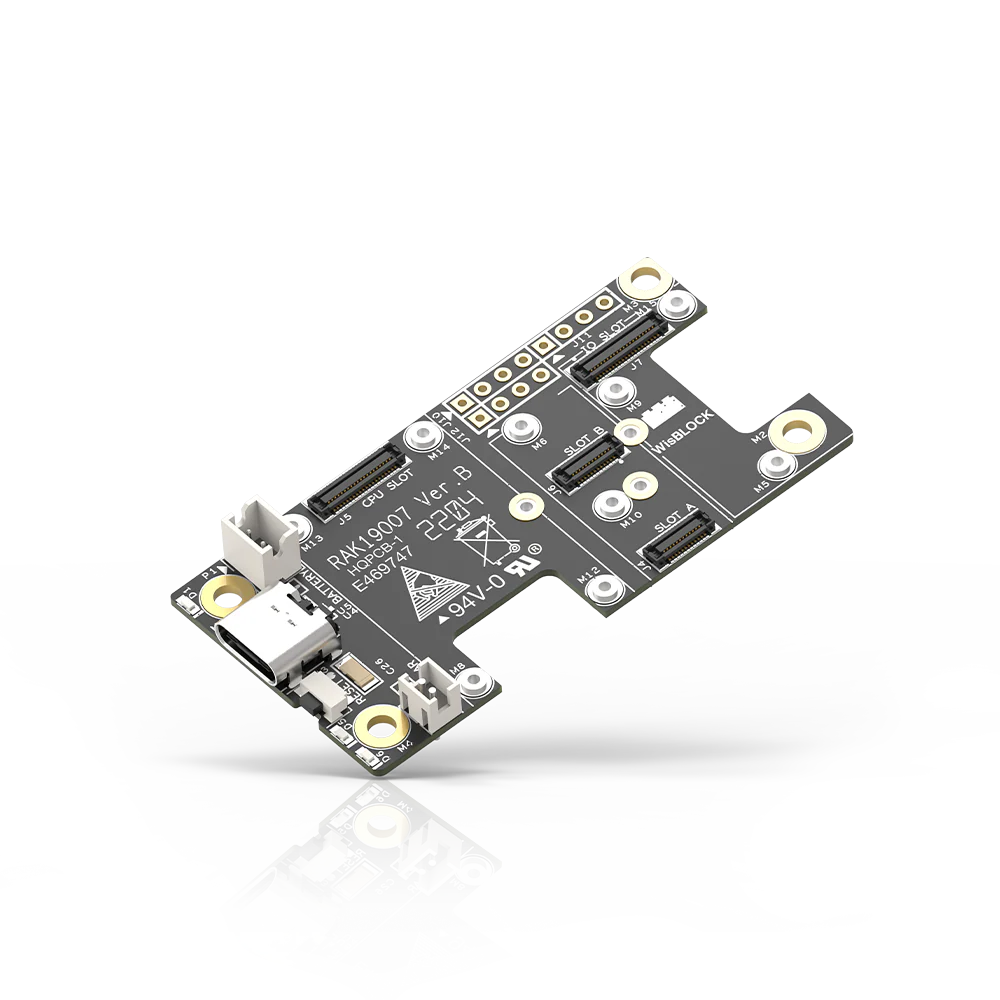

.. _rakwireless_rak19007:

RAK19007 WisBlock Base Board 2nd Gen
####################################

Overview
********

RAK19007 is a WisBlock Base Board 2nd Gen that connects WisBlock Core, WisBlock
IO, and WisBlock Modules. It provides the power supply and interconnection to the
modules attached to it. It has one slot reserved for the WisBlock Core module and
four slots A-D for WisBlock modules. The WisBlock Core is attached on the top side,
and the WisBlock modules are attached to the top or bottom side of the RAK19007.
The Slot D holds modules up to 23 mm in size, while slots A to C support 10 mm
WisBlock modules. Also, there are three 2.54 mm pitch headers for extension
interface with BOOT, GPIO, I2C, and UART pins.

For convenience, there is a Type-C USB connector that is connected directly to
WisBlock Core MCU’s USB port (if supported) or to a USB-UART converter depending on
the WisBlock Core. It can be used for uploading firmware or serial communication.
The USB-C connector is also used as a battery charging port.

WisBlock modules are connected to the RAK19007 WisBlock Base board via high-speed
board to board connectors. They provide secure and reliable interconnection to
ensure the signal integrity of each data bus. A set of screws are used for fixing
the modules, which makes it reliable even in an environment with lots of vibrations.

You can also use a RAK19005 WisBlock Sensor Extension Cable to position the WisBlock
modules apart from the WisBlock Base board or in any part of your case.

   RAK19007 WisBlock Base Board 2nd Gen (Credit: RAKwireless)

Product Features
****************

- 1 WisBlock Core module
- 1 WisBlock compatible with IO slot
- 4 WisBlock modules compatible with slots A-D
- 1 Type-C USB port for programming and debugging
- 3.7 V Rechargeable battery connector
- 5 V Solar panel connector
- Four 4-pin header with BOOT, I2C, and UART pins accessible with solder contacts

More information about the shield can be found at
`RAK19007 WisBlock Base Board 2nd Gen`_.

Requirements
************

RAK19007 WisBlock Mini Base Board requires a WisBlock Core module to operate. It is
compatible with almost all WisBlock Core modules, but the features available depend on
the specific WisBlock Core module used.

Mounting
********

WisBlock Core modules are mounted on the RAK19007 WisBlock Base board using the 40-pin header,
called WisBlock I/O connector. It is compatible with the WisBlock ecosystem, allowing for easy
integration with various WisBlock modules and sensors.

The mounting guides for RAK19007 can be found at `RAK19007 WisBlock Base Board Installation Guide`_.

Pin Assignments
***************

WisBlock IO Connector Pin Assignments

+----------+-----+-----+----------+
| Function | Pin | Pin | Function |
+----------+-----+-----+----------+
| VBAT     | 1   | 2   | VBAT     |
+----------+-----+-----+----------+
| GND      | 3   | 4   | GND      |
+----------+-----+-----+----------+
| 3V3      | 5   | 6   | 3V3      |
+----------+-----+-----+----------+
| USB_P    | 7   | 8   | USB_N    |
+----------+-----+-----+----------+
| VBUS     | 9   | 10  | SW1      |
+----------+-----+-----+----------+
| TXD0     | 11  | 12  | RXD0     |
+----------+-----+-----+----------+
| RESET    | 13  | 14  | LED1     |
+----------+-----+-----+----------+
| LED2     | 15  | 16  | LED3     |
+----------+-----+-----+----------+
| VDD      | 17  | 18  | VDD      |
+----------+-----+-----+----------+
| I2C1_SDA | 19  | 20  | I2C1_SCL |
+----------+-----+-----+----------+
| AIN0     | 21  | 22  | AIN1     |
+----------+-----+-----+----------+
| BOOT0    | 23  | 24  | IO7      |
+----------+-----+-----+----------+
| SPI_CS   | 25  | 26  | SPI_CLK  |
+----------+-----+-----+----------+
| SPI_MISO | 27  | 28  | SPI_MOSI |
+----------+-----+-----+----------+
| IO1      | 29  | 30  | IO2      |
+----------+-----+-----+----------+
| IO3      | 31  | 32  | IO4      |
+----------+-----+-----+----------+
| TXD1     | 33  | 34  | RXD1     |
+----------+-----+-----+----------+
| I2C2_SDA | 35  | 36  | I2C2_SCL |
+----------+-----+-----+----------+
| IO5      | 37  | 38  | IO6      |
+----------+-----+-----+----------+
| GND      | 39  | 40  | GND      |
+----------+-----+-----+----------+

WisBlock Sensor Slot A-D Pin Assignments

+----------+----------+----------+----------+-----+-----+----------+----------+----------+----------+
| D        | C        | B        | A        | Pin | Pin | A        | B        | C        | D        |
+----------+----------+----------+----------+-----+-----+----------+----------+----------+----------+
| NC       | NC       | NC       | TXD0     | 1   | 2   | GND      | GND      | GND      | GND      |
+----------+----------+----------+----------+-----+-----+----------+----------+----------+----------+
| SPI_CS   | SPI_CS   | SPI_CS   | SPI_CS   | 3   | 4   | SPI_CS   | SPI_CS   | SPI_CS   | SPI_CS   |
+----------+----------+----------+----------+-----+-----+----------+----------+----------+----------+
| SPI_MISO | SPI_MISO | SPI_MISO | SPI_MISO | 5   | 6   | SPI_MOSI | SPI_MOSI | SPI_MOSI | SPI_MOSI |
+----------+----------+----------+----------+-----+-----+----------+----------+----------+----------+
| I2C1_SCL | I2C1_SCL | I2C1_SCL | I2C1_SCL | 7   | 8   | I2C1_SDA | I2C1_SDA | I2C1_SDA | I2C1_SDA |
+----------+----------+----------+----------+-----+-----+----------+----------+----------+----------+
| VDD      | VDD      | VDD      | VDD      | 9   | 10  | IO2      | IO1      | IO4      | IO6      |
+----------+----------+----------+----------+-----+-----+----------+----------+----------+----------+
| 3V3      | 3V3      | 3V3      | 3V3      | 11  | 12  | IO1      | IO2      | IO3      | IO5      |
+----------+----------+----------+----------+-----+-----+----------+----------+----------+----------+
| NC       | NC       | NC       | NC       | 13  | 14  | 3V3      | 3V3      | 3V3      | 3V3      |
+----------+----------+----------+----------+-----+-----+----------+----------+----------+----------+
| NC       | NC       | NC       | NC       | 15  | 16  | VDD      | VDD      | VDD      | VDD      |
+----------+----------+----------+----------+-----+-----+----------+----------+----------+----------+
| NC       | NC       | NC       | NC       | 17  | 18  | NC       | NC       | NC       | NC       |
+----------+----------+----------+----------+-----+-----+----------+----------+----------+----------+
| NC       | NC       | NC       | NC       | 19  | 20  | NC       | NC       | NC       | NC       |
+----------+----------+----------+----------+-----+-----+----------+----------+----------+----------+
| NC       | NC       | NC       | NC       | 21  | 22  | NC       | NC       | NC       | NC       |
+----------+----------+----------+----------+-----+-----+----------+----------+----------+----------+
| GND      | GND      | GND      | GND      | 19  | 20  | RXD0     | NC       | NC       | NC       |
+----------+----------+----------+----------+-----+-----+----------+----------+----------+----------+

Programming
***********

Set ``--shield rakwireless_rak19007`` when you invoke ``west build``,
for example:

.. zephyr-app-commands::
   :zephyr-app: samples/drivers/fuel_gauge
   :board: rak4631/nrf52840
   :shield: rakwireless_rak19007
   :goals: build flash

References
**********

.. target-notes::

.. _RAK19007 WisBlock Base Board 2nd Gen:
   https://docs.rakwireless.com/product-categories/wisblock/rak19007

.. _RAK19007 WisBlock Base Board Installation Guide:
   https://docs.rakwireless.com/product-categories/wisblock/rak19007/quickstart/#assembling-a-wisblock-module
