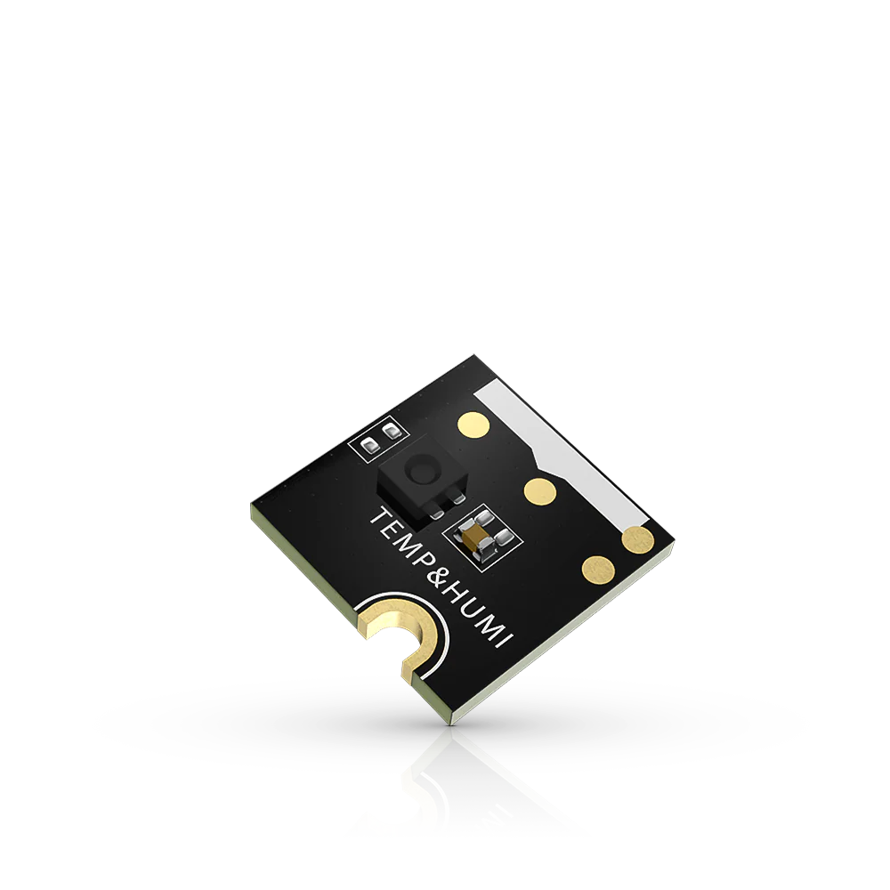

.. _rakwireless_rak1901:

RAK1901 WisBlock Temperature and Humidity Sensor
################################################

Overview
********

RAK1901 is a WisBlock Sensor which extends the WisBlock system
with a Sensirion SHTC3 temperature and humidity sensor.

   RAK1901 WisBlock Temperature and Humidity Sensor (Credit: RAKwireless)

Product Features
****************

- Sensor specifications
   - ±0.2° C temperature accuracy
   - -40° C to +125° C temperature range
   - ±2.0% RH humidity accuracy
   - 0 to 100% humidity range
   - Voltage Supply: 3.3 V
   - Current Consumption: 0.3 uA to 270 uA
   - Chipset: Sensirion SHTC3
- Size
   - 10 x 10 mm

More information about the shield can be found at
`RAK1901 WisBlock Temperature and Humidity Sensor`_.

Requirements
************

To use a RAK1901, you need at least a WisBlock Base to plug
the module in. WisBlock Base provides power supply to the
RAK1901 module. Furthermore, you need a WisBlock Core module
to use the sensor.

Mounting
********

The figure shows the mounting mechanism of the RAK1901 module
on a WisBlock Base board. The RAK1901 module can be mounted
on the slots: A, B, C, D, E, & F.

.. figure:: img/mounting.webp
   :align: center
   :alt: RAK1901 WisBlock Sensor Mounting

   RAK1901 WisBlock Sensor Mounting (Credit: RAKwireless)

The mounting guide for RAK1901 can be found at `RAK1901 WisBlock Assembly Guide`_.

Pin Assignments
***************

WisBlock Sensor Slot A-C Pin Assignments

+-------------+----------+----------+----------+-----+-----+----------+----------+----------+-------------+
| Used        | C        | B        | A        | Pin | Pin | A        | B        | C        | Used        |
+-------------+----------+----------+----------+-----+-----+----------+----------+----------+-------------+
|             | NC       | NC       | TXD0     | 1   | 2   | GND      | GND      | GND      |             |
+-------------+----------+----------+----------+-----+-----+----------+----------+----------+-------------+
|             | SPI_CS   | SPI_CS   | SPI_CS   | 3   | 4   | SPI_CS   | SPI_CS   | SPI_CS   |             |
+-------------+----------+----------+----------+-----+-----+----------+----------+----------+-------------+
|             | SPI_MISO | SPI_MISO | SPI_MISO | 5   | 6   | SPI_MOSI | SPI_MOSI | SPI_MOSI |             |
+-------------+----------+----------+----------+-----+-----+----------+----------+----------+-------------+
| SCL         | I2C1_SCL | I2C1_SCL | I2C1_SCL | 7   | 8   | I2C1_SDA | I2C1_SDA | I2C1_SDA | SDA (0x70)  |
+-------------+----------+----------+----------+-----+-----+----------+----------+----------+-------------+
|             | VDD      | VDD      | VDD      | 9   | 10  | IO2      | IO1      | IO4      |             |
+-------------+----------+----------+----------+-----+-----+----------+----------+----------+-------------+
|             | 3V3      | 3V3      | 3V3      | 11  | 12  | IO1      | IO2      | IO3      |             |
+-------------+----------+----------+----------+-----+-----+----------+----------+----------+-------------+
|             | NC       | NC       | NC       | 13  | 14  | 3V3      | 3V3      | 3V3      |             |
+-------------+----------+----------+----------+-----+-----+----------+----------+----------+-------------+
|             | NC       | NC       | NC       | 15  | 16  | VDD      | VDD      | VDD      |             |
+-------------+----------+----------+----------+-----+-----+----------+----------+----------+-------------+
|             | NC       | NC       | NC       | 17  | 18  | NC       | NC       | NC       |             |
+-------------+----------+----------+----------+-----+-----+----------+----------+----------+-------------+
|             | NC       | NC       | NC       | 19  | 20  | NC       | NC       | NC       |             |
+-------------+----------+----------+----------+-----+-----+----------+----------+----------+-------------+
|             | NC       | NC       | NC       | 21  | 22  | NC       | NC       | NC       |             |
+-------------+----------+----------+----------+-----+-----+----------+----------+----------+-------------+
|             | GND      | GND      | GND      | 23  | 24  | RXD0     | NC       | NC       |             |
+-------------+----------+----------+----------+-----+-----+----------+----------+----------+-------------+

WisBlock Sensor Slot D-F Pin Assignments

+-------------+----------+----------+----------+-----+-----+----------+----------+----------+-------------+
| Used        | F        | E        | D        | Pin | Pin | D        | E        | F        | Used        |
+-------------+----------+----------+----------+-----+-----+----------+----------+----------+-------------+
|             | TXD1     | TXD0     | NC       | 1   | 2   | GND      | GND      | GND      |             |
+-------------+----------+----------+----------+-----+-----+----------+----------+----------+-------------+
|             | SPI_CS   | SPI_CS   | SPI_CS   | 3   | 4   | SPI_CS   | SPI_CS   | SPI_CS   |             |
+-------------+----------+----------+----------+-----+-----+----------+----------+----------+-------------+
|             | SPI_MISO | SPI_MISO | SPI_MISO | 5   | 6   | SPI_MOSI | SPI_MOSI | SPI_MOSI |             |
+-------------+----------+----------+----------+-----+-----+----------+----------+----------+-------------+
| SCL         | I2C1_SCL | I2C1_SCL | I2C1_SCL | 7   | 8   | I2C1_SDA | I2C1_SDA | I2C1_SDA | SDA (0x70)  |
+-------------+----------+----------+----------+-----+-----+----------+----------+----------+-------------+
|             | VDD      | VDD      | VDD      | 9   | 10  | IO6      | IO3      | IO5      |             |
+-------------+----------+----------+----------+-----+-----+----------+----------+----------+-------------+
|             | 3V3      | 3V3      | 3V3      | 11  | 12  | IO5      | IO4      | IO6      |             |
+-------------+----------+----------+----------+-----+-----+----------+----------+----------+-------------+
|             | NC       | NC       | NC       | 13  | 14  | 3V3      | 3V3      | 3V3      |             |
+-------------+----------+----------+----------+-----+-----+----------+----------+----------+-------------+
|             | NC       | NC       | NC       | 15  | 16  | VDD      | VDD      | VDD      |             |
+-------------+----------+----------+----------+-----+-----+----------+----------+----------+-------------+
|             | NC       | NC       | NC       | 17  | 18  | NC       | NC       | NC       |             |
+-------------+----------+----------+----------+-----+-----+----------+----------+----------+-------------+
|             | NC       | NC       | NC       | 19  | 20  | NC       | NC       | NC       |             |
+-------------+----------+----------+----------+-----+-----+----------+----------+----------+-------------+
|             | NC       | NC       | NC       | 21  | 22  | NC       | NC       | NC       |             |
+-------------+----------+----------+----------+-----+-----+----------+----------+----------+-------------+
|             | GND      | GND      | GND      | 23  | 24  | NC       | RXD0     | RXD1     |             |
+-------------+----------+----------+----------+-----+-----+----------+----------+----------+-------------+

Programming
***********

Set ``--shield rakwireless_rak1901`` when you invoke ``west build``,
for example:

.. zephyr-app-commands::
   :zephyr-app: samples/sensor/dht_polling/
   :board: rak3312/esp32s3/procpu
   :shield: rakwireless_rak19007,rakwireless_rak1901
   :goals: build flash

References
**********

.. target-notes::

.. _RAK1901 WisBlock Assembly Guide:
   https://docs.rakwireless.com/product-categories/wisblock/rak1901/quickstart/#assembling-a-wisblock-module

.. _RAK1901 WisBlock Temperature and Humidity Sensor:
   https://docs.rakwireless.com/product-categories/wisblock/rak1901/overview
