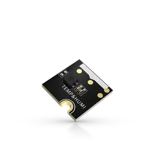

.. _rakwireless_rak1901:

RAK1901 WisBlock Temperature and Humidity Sensor
################################################

Overview
********

RAK1901 is a WisBlock sensor module built around the Sensirion SHTC3
temperature and humidity sensor. It connects to the WisBlock sensor I2C bus
at address ``0x70``.

   RAK1901 WisBlock Temperature and Humidity Sensor (Credit: RAKwireless)

More information about the module can be found at
`RAK1901 WisBlock Temperature & Humidity Sensor`_.

Requirements
************

This shield requires a WisBlock core that provides the ``wisblock_i2c1``
connector, for example ``rak4631/nrf52840``. The core is mounted on a WisBlock
base board such as the RAK19007.

Programming
***********

Set ``--shield rakwireless_rak1901`` when you invoke ``west build``. For example
when running the :zephyr:code-sample:`dht_polling` sample:

.. zephyr-app-commands::
   :zephyr-app: samples/sensor/dht_polling
   :board: rak4631/nrf52840
   :shield: rakwireless_rak1901
   :goals: build

.. _RAK1901 WisBlock Temperature & Humidity Sensor:
   https://docs.rakwireless.com/product-categories/wisblock/rak1901
