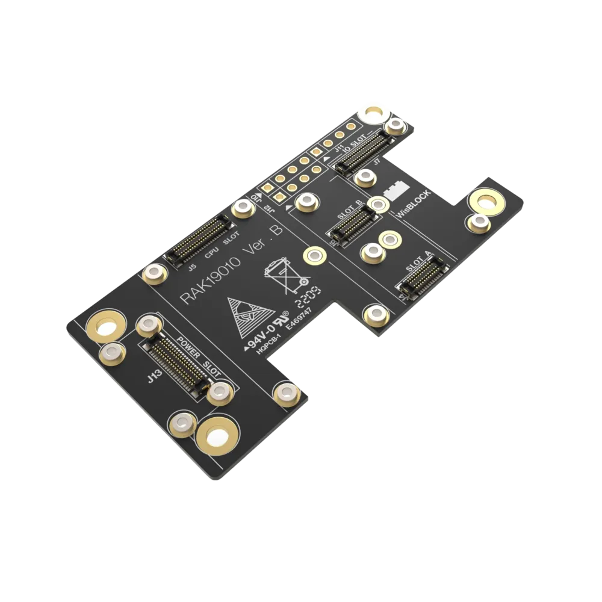
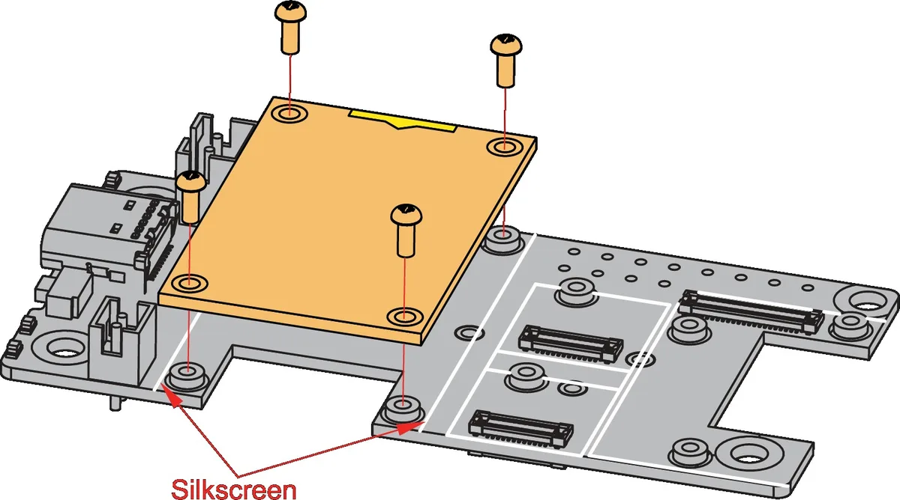

.. _rakwireless_rak19010:

RAK19010 WisBlock Base Board with Power Slot
############################################

Overview
********

RAK19010 is a WisBlock Base Board with Power Slot that connects WisBlock Core and
other WisBlock Modules. The power slot of RAK19010 is required to have an attached
WisBlock Power Slot module that provides power supply to the core and other modules.
There are many different types of power slot modules compatible with RAK19010 and
the choice will depend on the type of application.

It has one slot reserved for the power slot module, one for the core module, one
slot for the IO module, and four sensor slots A-D for small WisBlock modules. The
WisBlock Core, Power, and IO modules are attached on the top side, and smaller
WisBlock modules can be attached to the top or bottom side of the RAK19010. Slot
A and D hold modules up to 23 mm in size, while all slots A up to D support 10 mm
WisBlock modules. Also, there are three 2.54 mm pitch headers for extension
interface with BOOT, GPIO, ADC, I2C, and UART pins.

WisBlock modules are connected to the RAK19010 WisBlock Base board via high-speed
board-to-board connectors. They provide secure and reliable interconnection to ensure
the signal integrity of each data bus. A set of screws is used to fix the modules,
making it reliable even in an environment with lots of vibrations.

You can also use a RAK19005 WisBlock Sensor Extension Cable or RAK19008 WisBlock
IO Extension Cable  to position the WisBlock modules apart from the WisBlock Base
board or in any part of your case.

   RAK19010 WisBlock Base Board with Power Slot (Credit: RAKwireless)

Product Features
****************

- Flexible building block design, which enables modular function realization and expansion
- High-speed interconnection secured with screws to ensure signal integrity
- Supports multiple types of low-power MCUs
- Supports multiple types of sensors - a single board can support a combination of two different types of sensors
- Module Slots
   - 1 WisBlock Core module
   - 1 WisBlock Power Slot module
   - 1 WisBlock module compatible with IO slot
   - 4 WisBlock modules compatible with slots A-D
   - Pin headers accessible pins for BOOT, GPIO, ADC, I2C, and UART interfaces
- Size
   - RAK19010 has a size of only 30 x 60 mm, which lets you create solutions that fit into the smallest housings.

More information about the shield can be found at
`RAK19010 WisBlock Base Board with Power Slot`_.

Requirements
************

RAK19010 WisBlock Base Board requires a WisBlock Core module and a WisBlock Power module
to operate. It is compatible with almost all WisBlock Core modules, but the features
available depend on the specific WisBlock Core module used.

Supported WisBlock Core modules

- RAK3312
- RAK3372
- RAK3401
- RAK4631
- RAK11310
- RAK11722

Supported WisBlock Power modules

- RAK19012
- RAK19013
- RAK19014
- RAK19015
- RAK19017

Mounting
********

WisBlock Core modules are mounted on the RAK19010 WisBlock Base Board with Power Slot using the 40-pin header,
called WisBlock I/O connector. It is compatible with the WisBlock ecosystem, allowing for easy
integration with various WisBlock modules and sensors.

The mounting guides for RAK19010 can be found at `RAK19010 WisBlock Base Board with Power Slot Installation Guide`_.

Pin Assignments
***************

WisBlock IO Connector Pin Assignments

+----------+-----+-----+----------+
| Function | Pin | Pin | Function |
+----------+-----+-----+----------+
| VBAT     | 1   | 2   | VBAT     |
+----------+-----+-----+----------+
| GND      | 3   | 4   | GND      |
+----------+-----+-----+----------+
| 3V3      | 5   | 6   | 3V3      |
+----------+-----+-----+----------+
| USB_P    | 7   | 8   | USB_N    |
+----------+-----+-----+----------+
| VBUS     | 9   | 10  | SW1      |
+----------+-----+-----+----------+
| TXD0     | 11  | 12  | RXD0     |
+----------+-----+-----+----------+
| RESET    | 13  | 14  | LED1     |
+----------+-----+-----+----------+
| LED2     | 15  | 16  | LED3     |
+----------+-----+-----+----------+
| VDD      | 17  | 18  | VDD      |
+----------+-----+-----+----------+
| I2C1_SDA | 19  | 20  | I2C1_SCL |
+----------+-----+-----+----------+
| AIN0     | 21  | 22  | AIN1     |
+----------+-----+-----+----------+
| BOOT0    | 23  | 24  | IO7      |
+----------+-----+-----+----------+
| SPI_CS   | 25  | 26  | SPI_CLK  |
+----------+-----+-----+----------+
| SPI_MISO | 27  | 28  | SPI_MOSI |
+----------+-----+-----+----------+
| IO1      | 29  | 30  | IO2      |
+----------+-----+-----+----------+
| IO3      | 31  | 32  | IO4      |
+----------+-----+-----+----------+
| TXD1     | 33  | 34  | RXD1     |
+----------+-----+-----+----------+
| I2C2_SDA | 35  | 36  | I2C2_SCL |
+----------+-----+-----+----------+
| IO5      | 37  | 38  | IO6      |
+----------+-----+-----+----------+
| GND      | 39  | 40  | GND      |
+----------+-----+-----+----------+

WisBlock Sensor Slot A-D Pin Assignments

+----------+----------+----------+----------+-----+-----+----------+----------+----------+----------+
| D        | C        | B        | A        | Pin | Pin | A        | B        | C        | D        |
+----------+----------+----------+----------+-----+-----+----------+----------+----------+----------+
| NC       | NC       | NC       | TXD0     | 1   | 2   | GND      | GND      | GND      | GND      |
+----------+----------+----------+----------+-----+-----+----------+----------+----------+----------+
| SPI_CS   | SPI_CS   | SPI_CS   | SPI_CS   | 3   | 4   | SPI_CS   | SPI_CS   | SPI_CS   | SPI_CS   |
+----------+----------+----------+----------+-----+-----+----------+----------+----------+----------+
| SPI_MISO | SPI_MISO | SPI_MISO | SPI_MISO | 5   | 6   | SPI_MOSI | SPI_MOSI | SPI_MOSI | SPI_MOSI |
+----------+----------+----------+----------+-----+-----+----------+----------+----------+----------+
| I2C1_SCL | I2C1_SCL | I2C1_SCL | I2C1_SCL | 7   | 8   | I2C1_SDA | I2C1_SDA | I2C1_SDA | I2C1_SDA |
+----------+----------+----------+----------+-----+-----+----------+----------+----------+----------+
| VDD      | VDD      | VDD      | VDD      | 9   | 10  | IO2      | IO1      | IO4      | IO6      |
+----------+----------+----------+----------+-----+-----+----------+----------+----------+----------+
| 3V3      | 3V3      | 3V3      | 3V3      | 11  | 12  | IO1      | IO2      | IO3      | IO5      |
+----------+----------+----------+----------+-----+-----+----------+----------+----------+----------+
| NC       | NC       | NC       | NC       | 13  | 14  | 3V3      | 3V3      | 3V3      | 3V3      |
+----------+----------+----------+----------+-----+-----+----------+----------+----------+----------+
| NC       | NC       | NC       | NC       | 15  | 16  | VDD      | VDD      | VDD      | VDD      |
+----------+----------+----------+----------+-----+-----+----------+----------+----------+----------+
| NC       | NC       | NC       | NC       | 17  | 18  | NC       | NC       | NC       | NC       |
+----------+----------+----------+----------+-----+-----+----------+----------+----------+----------+
| NC       | NC       | NC       | NC       | 19  | 20  | NC       | NC       | NC       | NC       |
+----------+----------+----------+----------+-----+-----+----------+----------+----------+----------+
| NC       | NC       | NC       | NC       | 21  | 22  | NC       | NC       | NC       | NC       |
+----------+----------+----------+----------+-----+-----+----------+----------+----------+----------+
| GND      | GND      | GND      | GND      | 19  | 20  | RXD0     | NC       | NC       | NC       |
+----------+----------+----------+----------+-----+-----+----------+----------+----------+----------+

Programming
***********

Set ``--shield rakwireless_rak19010`` when you invoke ``west build``,
for example:

.. zephyr-app-commands::
   :zephyr-app: samples/drivers/fuel_gauge
   :board: rak4631/nrf52840
   :shield: rakwireless_rak19010,rakwireless_rak19012
   :goals: build flash

References
**********

.. target-notes::

.. _RAK19010 WisBlock Base Board with Power Slot:
   https://docs.rakwireless.com/product-categories/wisblock/rak19010

.. _RAK19010 WisBlock Base Board with Power Slot Installation Guide:
   https://docs.rakwireless.com/product-categories/wisblock/rak19010/quickstart/#assembling-a-wisblock-module
