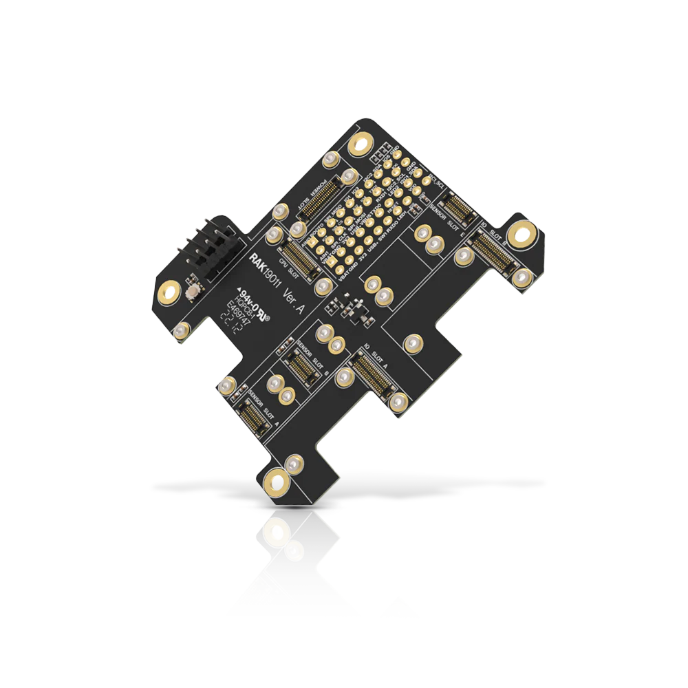

.. _rakwireless_rak19011:

RAK19011 WisBlock Dual IO Base Board with Power Slot
####################################################

Overview
********

RAK19011 is a WisBlock Dual IO Base Board with Power Slot that connects WisBlock Core,
WisBlock Power, and WisBlock Modules. It has one slot for the WisBlock Core module, one
for the WisBlock Power module, two IO slots, and six sensor slots (A to F) for WisBlock
Modules. There are also two 2.54 mm pitch headers exposing all key input-output pins of
the WisBlock Core, including UART, I2C, SPI, and many IO pins.

WisBlock Modules are connected to the RAK19011 WisBlock Dual IO Base Board with Power
Slot via high-speed board-to-board connectors. They provide secure and reliable
interconnection to ensure the signal integrity of each data bus. A set of screws is used
for fixing the modules, which makes it reliable even in a vibrating environment.
Additionally, it has a user-defined button.

   RAK19011 WisBlock Dual IO Base Board with Power Slot (Credit: RAKwireless)

Product Features
****************

- Flexible building block design enabling modular functionality and expansion.
- High-speed interconnection connectors in the WisBlock Base board ensure signal integrity.
- Multiple Headers and Modules Slots for WisBlock Modules
   - One core slot
   - One power slot
   - Two I/O slots
   - Six sensor (A to F) slots
   - All key input/output pins of the WisBlock Core are exposed via headers.
   - Access to various communication buses via headers: I2C, SPI, UART, and USB.
   - One user-defined push-button switch
- Size
   - 60 mm x 67 mm

More information about the shield can be found at
`RAK19011 WisBlock Dual IO Base Board with Power Slot`_.

Requirements
************

RAK19011 WisBlock Dual IO Base Board with Power Slot requires a WisBlock Core module
and a WisBlock Power module to operate. It is compatible with almost all WisBlock Core
modules, but the features available depend on the specific WisBlock Core module used.

Supported WisBlock Core modules

- RAK3401
- RAK4631

Supported WisBlock Power modules

- RAK19012
- RAK19013
- RAK19014
- RAK19015
- RAK19017

Mounting
********

WisBlock Core modules are mounted on the RAK19011 WisBlock Dual IO Base Board with Power Slot using the 40-pin header,
called WisBlock I/O connector. It is compatible with the WisBlock ecosystem, allowing for easy
integration with various WisBlock modules and sensors.

The mounting guides for RAK19011 can be found at `RAK19011 WisBlock Dual IO Base Board with Power Slot Installation Guide`_.

.. figure:: img/mounting.webp
   :align: center
   :alt: RAK19011 mounting

Pin Assignments
***************

WisBlock IO Connector Pin Assignments

+----------+-----+-----+----------+
| Function | Pin | Pin | Function |
+----------+-----+-----+----------+
| VBAT     | 1   | 2   | VBAT     |
+----------+-----+-----+----------+
| GND      | 3   | 4   | GND      |
+----------+-----+-----+----------+
| 3V3      | 5   | 6   | 3V3      |
+----------+-----+-----+----------+
| USB_P    | 7   | 8   | USB_N    |
+----------+-----+-----+----------+
| VBUS     | 9   | 10  | SW1      |
+----------+-----+-----+----------+
| TXD0     | 11  | 12  | RXD0     |
+----------+-----+-----+----------+
| RESET    | 13  | 14  | LED1     |
+----------+-----+-----+----------+
| LED2     | 15  | 16  | LED3     |
+----------+-----+-----+----------+
| VDD      | 17  | 18  | VDD      |
+----------+-----+-----+----------+
| I2C1_SDA | 19  | 20  | I2C1_SCL |
+----------+-----+-----+----------+
| AIN0     | 21  | 22  | AIN1     |
+----------+-----+-----+----------+
| BOOT0    | 23  | 24  | IO7      |
+----------+-----+-----+----------+
| SPI_CS   | 25  | 26  | SPI_CLK  |
+----------+-----+-----+----------+
| SPI_MISO | 27  | 28  | SPI_MOSI |
+----------+-----+-----+----------+
| IO1      | 29  | 30  | IO2      |
+----------+-----+-----+----------+
| IO3      | 31  | 32  | IO4      |
+----------+-----+-----+----------+
| TXD1     | 33  | 34  | RXD1     |
+----------+-----+-----+----------+
| I2C2_SDA | 35  | 36  | I2C2_SCL |
+----------+-----+-----+----------+
| IO5      | 37  | 38  | IO6      |
+----------+-----+-----+----------+
| GND      | 39  | 40  | GND      |
+----------+-----+-----+----------+

WisBlock Sensor Slot A-C Pin Assignments

+----------+----------+----------+-----+-----+----------+----------+----------+
| C        | B        | A        | Pin | Pin | A        | B        | C        |
+----------+----------+----------+-----+-----+----------+----------+----------+
| NC       | NC       | TXD0     | 1   | 2   | GND      | GND      | GND      |
+----------+----------+----------+-----+-----+----------+----------+----------+
| SPI_CS   | SPI_CS   | SPI_CS   | 3   | 4   | SPI_CS   | SPI_CS   | SPI_CS   |
+----------+----------+----------+-----+-----+----------+----------+----------+
| SPI_MISO | SPI_MISO | SPI_MISO | 5   | 6   | SPI_MOSI | SPI_MOSI | SPI_MOSI |
+----------+----------+----------+-----+-----+----------+----------+----------+
| I2C1_SCL | I2C1_SCL | I2C1_SCL | 7   | 8   | I2C1_SDA | I2C1_SDA | I2C1_SDA |
+----------+----------+----------+-----+-----+----------+----------+----------+
| VDD      | VDD      | VDD      | 9   | 10  | IO2      | IO1      | IO4      |
+----------+----------+----------+-----+-----+----------+----------+----------+
| 3V3      | 3V3      | 3V3      | 11  | 12  | IO1      | IO2      | IO3      |
+----------+----------+----------+-----+-----+----------+----------+----------+
| NC       | NC       | NC       | 13  | 14  | 3V3      | 3V3      | 3V3      |
+----------+----------+----------+-----+-----+----------+----------+----------+
| NC       | NC       | NC       | 15  | 16  | VDD      | VDD      | VDD      |
+----------+----------+----------+-----+-----+----------+----------+----------+
| NC       | NC       | NC       | 17  | 18  | NC       | NC       | NC       |
+----------+----------+----------+-----+-----+----------+----------+----------+
| NC       | NC       | NC       | 19  | 20  | NC       | NC       | NC       |
+----------+----------+----------+-----+-----+----------+----------+----------+
| NC       | NC       | NC       | 21  | 22  | NC       | NC       | NC       |
+----------+----------+----------+-----+-----+----------+----------+----------+
| GND      | GND      | GND      | 19  | 20  | RXD0     | NC       | NC       |
+----------+----------+----------+-----+-----+----------+----------+----------+

WisBlock Sensor Slot D-F Pin Assignments

+----------+----------+----------+-----+-----+----------+----------+----------+
| F        | E        | D        | Pin | Pin | D        | E        | F        |
+----------+----------+----------+-----+-----+----------+----------+----------+
| TXD1     | TXD0     | NC       | 1   | 2   | GND      | GND      | GND      |
+----------+----------+----------+-----+-----+----------+----------+----------+
| SPI_CS   | SPI_CS   | SPI_CS   | 3   | 4   | SPI_CS   | SPI_CS   | SPI_CS   |
+----------+----------+----------+-----+-----+----------+----------+----------+
| SPI_MISO | SPI_MISO | SPI_MISO | 5   | 6   | SPI_MOSI | SPI_MOSI | SPI_MOSI |
+----------+----------+----------+-----+-----+----------+----------+----------+
| I2C1_SCL | I2C1_SCL | I2C1_SCL | 7   | 8   | I2C1_SDA | I2C1_SDA | I2C1_SDA |
+----------+----------+----------+-----+-----+----------+----------+----------+
| VDD      | VDD      | VDD      | 9   | 10  | IO6      | IO3      | IO5      |
+----------+----------+----------+-----+-----+----------+----------+----------+
| 3V3      | 3V3      | 3V3      | 11  | 12  | IO5      | IO4      | IO6      |
+----------+----------+----------+-----+-----+----------+----------+----------+
| NC       | NC       | NC       | 13  | 14  | 3V3      | 3V3      | 3V3      |
+----------+----------+----------+-----+-----+----------+----------+----------+
| NC       | NC       | NC       | 15  | 16  | VDD      | VDD      | VDD      |
+----------+----------+----------+-----+-----+----------+----------+----------+
| NC       | NC       | NC       | 17  | 18  | NC       | NC       | NC       |
+----------+----------+----------+-----+-----+----------+----------+----------+
| NC       | NC       | NC       | 19  | 20  | NC       | NC       | NC       |
+----------+----------+----------+-----+-----+----------+----------+----------+
| NC       | NC       | NC       | 21  | 22  | NC       | NC       | NC       |
+----------+----------+----------+-----+-----+----------+----------+----------+
| GND      | GND      | GND      | 19  | 20  | NC       | RXD0     | RXD1     |
+----------+----------+----------+-----+-----+----------+----------+----------+

Programming
***********

Set ``--shield rakwireless_rak19011`` when you invoke ``west build``,
for example:

.. zephyr-app-commands::
   :zephyr-app: samples/drivers/fuel_gauge
   :board: rak4631/nrf52840
   :shield: rakwireless_rak19011,rakwireless_rak19012
   :goals: build flash

References
**********

.. target-notes::

.. _RAK19011 WisBlock Dual IO Base Board with Power Slot:
   https://docs.rakwireless.com/product-categories/wisblock/rak19011

.. _RAK19011 WisBlock Dual IO Base Board with Power Slot Installation Guide:
   https://docs.rakwireless.com/product-categories/wisblock/rak19011/quickstart/#assembling-a-wisblock-module
