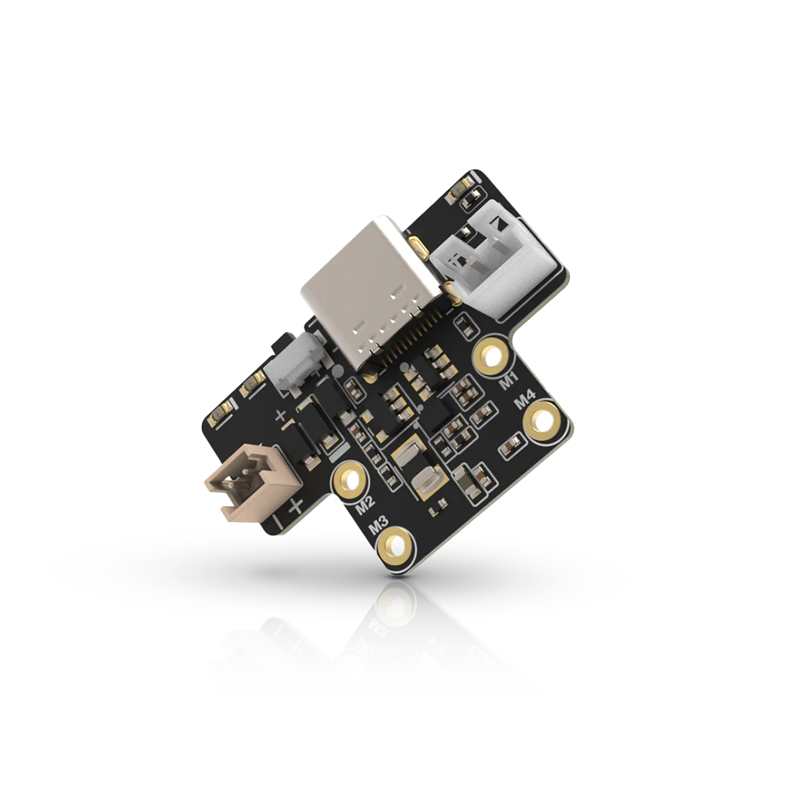

.. _rakwireless_rak19012:

RAK19012 WisBlock USB LiPo Solar Power Slot Module
##################################################

Overview
********

The RAK19012 WisBlock USB LiPo Solar Power Slot Module is a power board comprising a
USB-C connector, a battery connector with an onboard charger, a solar panel connector,
an LED indicator for charge status, two user-configurable LEDs, a reset button, a power
connector for connection with the WisBlock Base board. This power board enables debugging
and firmware uploading to the WisBlock Core via the USB-C connector.

   RAK19012 WisBlock USB LiPo Solar Power Slot Module (Credit: RAKwireless)

Product Features
****************

- USB-C connector for programming and debugging the WisBlock Core
- Compatible with LiPo rechargeable batteries
- Solar panel connector for battery charging
- Onboard battery charger chip
- LEDs for charging status and user-configurable LEDs
- Size: 30 mm x 20 mm

More information about the shield can be found at
`RAK19012 WisBlock USB LiPo Solar Power Slot Module`_.

Requirements
************

RAK19012 WisBlock USB LiPo Solar Power Slot Module is a power board that can be used
with any WisBlock Base board that has a Power Slot. It is compatible with almost all
WisBlock Base boards, but the features available depend on the specific WisBlock Base
board used.

Supported WisBlock Base boards

- RAK19009
- RAK19010
- RAK19011

Mounting
********

The RAK19012 module can be mounted on the power slot of a WisBlock Base board with a power slot.

The mounting guide for RAK19012 can be found at `RAK19012 WisBlock Assembly Guide`_.

Pin Assignments
***************

WisBlock Power Module Connector Pin Assignments

+-------------+----------+-----+-----+----------+-------------+
| Used        | A        | Pin | Pin | A        | Used        |
+-------------+----------+-----+-----+----------+-------------+
| VBAT        | VBAT     | 1   | 2   | VBAT     | VBAT        |
+-------------+----------+-----+-----+----------+-------------+
|             | GND      | 3   | 4   | GND      |             |
+-------------+----------+-----+-----+----------+-------------+
|             | 3V3      | 5   | 6   | 3V3      |             |
+-------------+----------+-----+-----+----------+-------------+
| USB_P       | USB_P    | 7   | 8   | USB_N    | USB_N       |
+-------------+----------+-----+-----+----------+-------------+
|             | VBUS     | 9   | 10  | SW1      |             |
+-------------+----------+-----+-----+----------+-------------+
|             | TXD0     | 11  | 12  | RXD0     |             |
+-------------+----------+-----+-----+----------+-------------+
| RESET       | RESET    | 13  | 14  | LED1     | LED1        |
+-------------+----------+-----+-----+----------+-------------+
| LED2        | LED2     | 15  | 16  | LED3     |             |
+-------------+----------+-----+-----+----------+-------------+
|             | VDD      | 17  | 18  | VDD      |             |
+-------------+----------+-----+-----+----------+-------------+
|             | I2C1_SDA | 19  | 20  | I2C1_SCL |             |
+-------------+----------+-----+-----+----------+-------------+
| ADC_VBAT    | AIN0     | 21  | 22  | AIN1     |             |
+-------------+----------+-----+-----+----------+-------------+
|             | BOOT0    | 23  | 24  | IO7      |             |
+-------------+----------+-----+-----+----------+-------------+
|             | SPI_CS   | 25  | 26  | SPI_CLK  |             |
+-------------+----------+-----+-----+----------+-------------+
|             | SPI_MISO | 27  | 28  | SPI_MOSI |             |
+-------------+----------+-----+-----+----------+-------------+
|             | IO1      | 29  | 30  | IO2      |             |
+-------------+----------+-----+-----+----------+-------------+
|             | IO3      | 31  | 32  | IO4      |             |
+-------------+----------+-----+-----+----------+-------------+
|             | TXD1     | 33  | 34  | RXD1     |             |
+-------------+----------+-----+-----+----------+-------------+
|             | I2C2_SDA | 35  | 36  | I2C2_SCL |             |
+-------------+----------+-----+-----+----------+-------------+
|             | IO5      | 37  | 38  | IO6      |             |
+-------------+----------+-----+-----+----------+-------------+
|             | GND      | 39  | 40  | GND      |             |
+-------------+----------+-----+-----+----------+-------------+

Programming
***********

Set ``--shield rakwireless_rak19012`` when you invoke ``west build``,
for example:

.. zephyr-app-commands::
   :zephyr-app: samples/drivers/fuel_gauge
   :board: rak4631/nrf52840
   :shield: rakwireless_rak19010,rakwireless_rak19012
   :goals: build flash

References
**********

.. target-notes::

.. _RAK19012 WisBlock Assembly Guide:
   https://docs.rakwireless.com/product-categories/wisblock/rak19012/quickstart/#assembling-a-wisblock-module

.. _RAK19012 WisBlock USB LiPo Solar Power Slot Module:
   https://docs.rakwireless.com/product-categories/wisblock/rak19012
